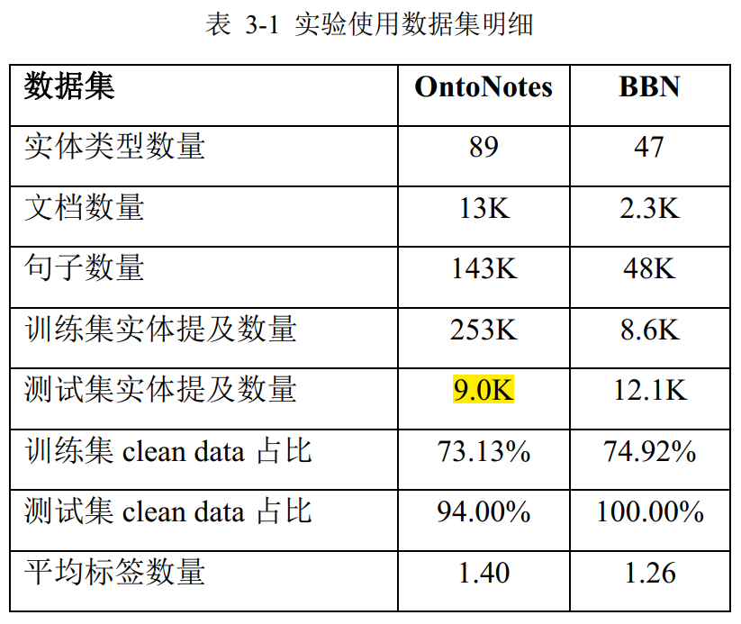

---

layout: post
title: FGET总结
mathjax: true
author: Wxl
date: 2020-11-21
header-style: text
excerpt_separator: <!--more-->
---

语料库级的细粒度实体分类  ---句子级的细粒度实体分类  

针对训练语料难以获取的问题， Ling 等人[3]提出了利用远程监督（ Distant Supervision， DS） [9]来获取细粒度实体分类的训练数据的方法，并构造了 **FIGER** 数据集， Gillick 等人[6]则用类似的方法标注了 **OntoNotes** 数据集， Ren 等人[15]为 学术界进一步提供了 **BBN** 数据集， Choi 等人[18]同样利用远程监督方法构造了迄 今为止最大的细粒度实体分类数据集 **UFET**。    

有三种策略推断真实的𝑦，不同策略的提出是为了处理类型之间的依赖关系。比如不应该同时给一个提及标注位置和人；又比如如果标注
了演员，那么这个提及也应该是表示一个人。 这三种策略如下：  

- 独立推断策略： 𝑝(𝑦|𝑥) > 0.5，就认为𝑥具有𝑦这个类型  。，如果对于所有 y，$𝑝(𝑦|𝑥) ≤ 0.5$，那么取𝑝(𝑦|𝑥)最大的 y 作为 x 的类型。这种方法主要应用于多分类的设定  Ling 等人[3]、 Shimaoka 等人[13]、 Onoe[8]  
- 自上而下搜索策略：这种方法认为每个提及只有一条类型路径，利用𝑝(𝑦|𝑥)或者非概率形式的打分函数，  进行从 root 节点开始往下的搜索，直到𝑝(𝑦|𝑥)小于某个阈值停止。  
- 单标签分类策略：这种方法将整个问题建模为一个单标签分类问题，认为对于一个提及来说，只有一个类型路径可以描述它在上下文中的意义。该方法将所有的类型用于分类，而只选择$𝑝(𝑦|𝑥)$最大的𝑦，然后将𝑦的所有祖先类型也作为预测的结果。 Xu 等人[16]、本文提出的两种方法均采用了这种策略。  

由于独立推断策略**忽略了类型之间的依赖关系**， 一些研究人员希望在模型训练中就考虑到类型依赖问题，他们通常认为𝜃是类型的向量表示，而不仅仅是分类器参数。 **Shimaoka2017**将类型𝑡所在的类型路径上所有父类型的向量与其本身相加作为𝑡的新向量表示。**Attentive2019**提出用奇异值分解去建模标签的潜在语义信息，用样本表示去重构其标签的潜在语义表示。  

在**提及表示**方面，研究人员还探索了许多不同的方法。 **Abhishek** 等人[31]采用单向长短时记忆网络去编码提及表示， **Xu** 等人[16]在提及表示方面综合采用了Abhishek 等人[31]和 Shimaoka 等人[13]的做法。 **Xiong** [^5 ]等人[24]考虑到对于代词提及来说，其词向量可能不能很好的表示提及，因此利用上下文隐层表示和提及隐层表示去建模提及表示，设计了一种门限机制去权衡上下文和提及本身对样本表示
的影响。 这种方法最初由 Dhingra 等人[32]提出，他们将其应用于阅读理解中的**共指提及**。 **Onoe** 等人[8]为了解决提及中常出现未登陆词并且建模提及的形态学特点，在提及表示的建模中加入了 Char-CNN。

在**上下文表示**方面，Xin  等人[34]利用实体的 TransE表示作为注意力机制的查询向量获得了与实体更相关的上下文表示，在他们自建的数据集上取得了一定效果。 Onoe 等人[8]探索了采用 BERT[36]编码上下文的方法。 Zhou [^6]等人[37]则将细粒度实体分类建模为一个匹配问题， 采用预训练的 ELMo 向量直接编码提及所在上下文，通过检索加规则匹配的方法去处理零样本实体分类问题， ELMo 句向量的
编码被应用于句子相似度的计算。 在预训练语言模型的利用这方面还没有很大的进展，这一方向尚有比较大的研究空间。

在**类型向量θ**方面， 为了处理零样本与少样本的情况， Ma [^7]等人[38]利用类型与实体的共现去寻找类型的典型实体，利用典型实体的词向量作为类型向量。而Yuan [^8]等人[39]则利用类型的名字如 PERSON 的词向量作为类型向量θ。 Onoe 等人[8]则利用类型的 WordNet[40]定义去构造类型向量。  

对于带噪声标签的数据的应用现状  

噪声标签的产生是由于远程监督对于语料的标注中只考虑知识库而忽视了上下文，因此这种标注错误又称为脱离上下文的噪声（out-of-text noise）。 为了克服脱离上下文的噪声的影响，人们做出了很多的尝试，通常来说分成三种做法：

- **第一种方法忽视噪声**标签的影响，将问题建模为多分类问题，直接用噪声数据去训练模型，结果通常较差； 
- 第二种方法试图**过滤掉带有噪声标签的数据**或者噪声标签，然后再用去噪后的语料训练模型， Gillick 等人[6]通过启发式的规则来过滤噪声标签， Onoe 等人[8]等人通过训练一个神经网络分类器来删除和修正噪声标签，Ren 等人[7]通过知识库的先验知识和基于(PPL)部分标记损失的标签嵌入方法来删除噪声标签，这些方法较为依赖于研究人员的个人经验和数据集的特点而不通用；
-  第三种方法则基于部分标记损失（Partial Label Loss， $\color \red PLL$）来拟合不完美的远程监督数据，希望模型在噪声标签的影响下也具有很好的效果。  ==基本上都是这一种，可以利用噪声数据==
  - 所谓的部分标记损失的基本假设是：对一个带有噪声标签的提及来说， 候选标签(利用远程监
    督获取  )集合中模型预测的分数最大的那个标签的分数应该大于所有的不在候选集合中的标签，  

Ren 等人[15]给出了 rank loss 版本的部分标记损失方法， Abhishek 等人[31]利用部分标记损失同时嵌入类型与样本，加入迁移学习，将 BBN 数据集上的结果提高到了 0.733（strict acc）； Xu 等人[16]提出了利用 softmax 作为多分类器情况下的部分标记损失方法，加入层次感知损失将 FIGER 数据集上的结果提高到了0.689（strict acc）。  

然而**基于部分标记损失的方法会严重的受到确认偏差**（Confirmation bias）的影响，所谓的确认偏差（Confirmation bias）就是指模型将自己的预测作为下一步优化的目标所带来的优化目标与实际目标的偏差。根据公式(2.9)，噪声标签中最大的那个类型$\hat y$将会作为模型下一步优化的目标，如果模型开始阶段选对了噪声 标签中的一个，那么后面的优化会持续的使模型选择这个目标（由于模型拟合的目标是减小部分标记损失），但如果模型开始就选错了提及 m 的标签，那么这种确认偏差就会不断的累计，使得模型退化。   

（1） OntoNotes 数据集[6]：该数据集最初由 Weischedel 等人[70]提供， Gillick等人[6]选择了其中的新闻部分作为远程监督细粒度实体分类的数据集，文档共13109 篇，其中 77 篇作为测试集由人工标注， 测试集总计 8963 个提及[16]，包含89种细粒度实体类型，实体类型层级为3层。**Gillick**等人[6]利用DBpedia spotlight[71]对测试集以外的新闻文档进行了远程监督实体链接，得到了带噪声的训练集， 总计 253241 个提及。
（2） BBN 数据集：该数据集最初由 Weischedel 等人[72]标注， 包含 2311 篇华尔街日报的文章，文章共有 48K 句子，包含 47 种实体类型，实体类型层级为 2层。 **Ren** 等人[15]利用远程监督对该语料库的训练集进行了标注， 得到了 86078 个训练集提及。人工标注的测试集提及数量则为 12845 个。两个数据集的明细如表 3-1 所示。 **从表中可以发现，实际上测试集大部分提及都是 clean data，这与本章采用 2.1.2 节所述的单标签多分类推断策略是一致的**，本章认为一个提及在上下文仅有一个类型路径可以描述它。  

!

!

为了公平比较， 本章**使用 Xu 等人[16]预处理过的 OntoNotes 数据集与 Abhishek等人[31]提供的 BBN 数据集**。为了调试超参数， 本章按照其他同类文章相同的做法，从测试集中随机抽样 10%的数据作为开发集， 用剩余的数据作测试集。  

# 问题

什么是候选标签

# Ling 

Ling[^3] 等人最早提出采用远程监督来构建细粒度实体分类数据集 FIGER。  Ling 等人[3]在 FIGER 数据集上构造了十种特征用于提及的样本表示。多标签多分类问题 $𝑦 ∈ R_{|T|}  $  ,

# Dong

Dong [^1]最早开始利**用神经网络去建模提及与其上下文的表示**  

他们的模型中将样本表示分为上下文表示、 提及表示，将两个表示拼接起来作为一个softmax 分类器[11]的输入。

词汇的表示采用 Turian 等人[28]预训练的词向量。在词向量的基础上，利用多层感知机去建模上下文表示，利用循环神经网络 Elman 网
络[29]去提取提及表示。  

# Gillick

Gillick[^2] 等人提出了**上下文依赖**的细粒度实体分类任务 。Gillick 等人[6]在 OntoNotes 数据集上加入了一些独有特征包括提及核心词的前三个字母、 自上而下搜索策略

# AFET2016

单标签多分类问题  $𝑦 ∈ R_{1×|T|}  $基于假设： 只有一条类型路径符合提及在上下文的意义 。自上而下搜索策略

# PLE2016

自上而下搜索策略

# Attentive2016

独立推断策略

# NFGEC2017

在上下文表示的编码上采用了循环神经网络加自注意力机制的方法，为后期的研究打下了重要基础 。并利用远程监督构建了 OntoNotes 数据集。之后，许多工作开始研究噪声数据的应用问题 。

Shimaoka 等人[13,14]在上下文表示的建模上采用了长短时记忆网络，然后利用自注意力机制（self attention mechanism） 来融合得到整个文本片段的特征表示，使得模型更加关注与分类相关的词汇片段。在提及表示上则采用了提及所有词向量的平均。 

# AAA2017

# KNET2018

# NFETC2018

单标签多分类问题\单标签分类策略：

# NFGEC-LME2018

探索了利用实体的知识库属性给实体进行细粒度实体分类的方法  

# UFET2018

# NFETC-CLSC2019

单标签多分类问题.。单标签分类策略：

# DenoiseET2019

训练模型筛选噪声样本 ,独立推断策略

# HFET2019(attentive)

# NFETC-VAT2020

结合预训练语言模型 BERT 在 OntoNotes 上达到了当前最高水平  

# FGET-RR2020

# NFETC-AR2020

# ACL2020

# NDP2019

# EFGET2019

# IFETET2019

| models              | Denoise | 特征提取 | 分类模型 | 优点 | 缺点 |
| :------------------ | :-----: | :------: | -------- | ---- | ---- |
| AFET2016            |         |          |          |      |      |
| PLE2016             |         |          |          |      |      |
| AAA2017             |         |          |          |      |      |
| NFGEC2017           |         |          |          |      |      |
| KNET2018            |         |          |          |      |      |
| NFETC2018           |         |          |          |      |      |
| NFGEC-LME2018       |         |          |          |      |      |
| UFET2018            |         |          |          |      |      |
| NFETC-CLSC2019      |         |          |          |      |      |
| DenoiseET2019       |         |          |          |      |      |
| HFET2019(attentive) |         |          |          |      |      |
| NFETC-VAT2020       |         |          |          |      |      |
| FGET-RR2020         |         |          |          |      |      |
| NFETC-AR2020        |         |          |          |      |      |
| ACL2020             |         |          |          |      |      |
| NDP2019             |         |          |          |      |      |
| EFGET2019           |         |          |          |      |      |
| IFETET2019          |         |          |          |      |      |

# References

[^1]: Dong : A hybrid neural model for type classification of entity mentions[C],\2015.  
[^2]: Gillick D, Context-dependent fine-grained entity type tagging[J]. arXiv , 2014  
[^3]: Ling  Fine-grained entity recognition[C]. Twenty-Sixth AAAI 2012  
[^4]: Shimaoka. An Attentive Neural Architecture for Finegrained Entity Type Classification[C]. 2016:
[^5]: Xiong . Imposing Label-Relational Inductive Bias for Extremely Fine-Grained Entity Typing[J]  2019
[^6]: Zhou . Zero-Shot Open Entity Typing as Type Compatible Grounding[C]. , 2018:
[^7]: Ma . Label embedding for zero-shot fine-grained named entity typing[C]. COLING 2016
[^8]: [39] Yuan Otyper: A neural architecture for open named entity typing[C]., 2018.

