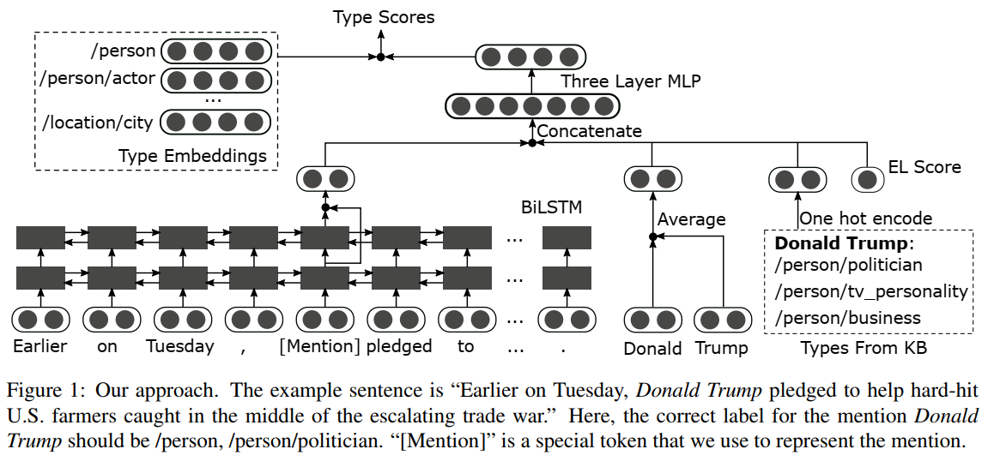

基于**上下文**和**从实体链接结果中获得的信息**进行预测

<!--more-->

# Improving Fine-grained Entity Typing with Entity Linking 

* TOC
{: toc}
'Spanish Workers Federation'

# Abstract  

细粒度的实体类型输入是一个具有挑战性的问题，因为它通常涉及相对较大的标记集，并且可能需要了解实体提及的上下文。在本文中，我们使用实体链接来帮助进行细粒度的实体类型分类处理。我们提出了一个深层神经模型，该模型基于**上下文**和**从实体链接结果中获得的信息**进行预测。在两个常用数据集上的实验结果证明了我们方法的有效性。在这两个数据集上，它都比现有技术实现了超过5％的绝对严格精度改进。

# 1 Introduction  　　

给定一段文字和本文中提及（指称）实体的范围，细粒度实体类型分类（FET）是为提及内容分配细粒度类型标签的任务。分配的标签标签应**依赖于上下文**例如，在“特朗普威胁要把美国从世界贸易组织中撤出”句子中，“虽然”唐纳德·特朗普（Donald Trump）也有其他职业，例如商务人士，电视名人等，但提到的“特朗普”应标为/person和/person/politician 。

该任务具有挑战性，因为它通常使用相对较**大的标签集**，并且有些提及可能需**要正确理解上下文**的标签。此外，由于人工注释的工作量很大，因此现有方法必须依靠远程监督来训练模型。

因此，**使用额外的信息**来帮助分类过程变得非常重要。在本文中，我们通过实体链接（EL）改进了FET 。**EL对于模型做出分类决定很有帮助，因为如果提及正确链接到它的目标实体，我们可以直接在知识库（KB）中获取有关该实体的类型信息**。例如，在句子“关于Federal Way 的各种问题上进行了很多讨论”中，某些FET模型可能将“Federal Way  ”的提法错误地标记为公司。将其链接到华盛顿的Federal Way 市后，可以避免这种错误。**对于需要了解上下文的情况，使用实体链接结果也是有益的**。在上述提到“特朗普”的示例中，获得了知识库中所有唐纳德·特朗普的类型（例如，政治家，人，电视人物等）的仍然可以提供信息，以推断出适合背景的正确类型（即政治人物），因为它们会**缩小可能的标签范围**。

但是，通过EL获得的信息不应完全信任，因为它**并不总是准确**的。即使提及正确链接到实体，KB中该实体的类型信息**也可能不完整或过时**。因此，在本文中，我们提出了一种深层神经细粒度实体类型输入模型，该模型可以根据**上下文，提及字符串**以及使用**EL获得的KB中的类型信息**灵活地预测标签。

使用EL还为训练程**带来了新问题**。 当前，构建FET训练样本的一种广泛使用的方法是使用Wikipedia中的**锚点链接**(Anchor Links)。每个锚链接均被视为提及，并以KB中所指向实体（锚链指向的Wikipedia页面）的所有类型进行**弱标记**。当正确链接提及内容时，我们的方法还使用KB中所指向实体的所有类型作为额外信息。这可能会导致训练后的模型**过拟合弱标签数据**。我们设计了合页损失（hinge loss )的变体，**并在训练过程中引入了噪音**以解决此问题。

我们在两个常用的FET数据集上进行实验。实验结果表明，引入通过实体链接获得的信息并具有深度神经模型都有助于改善FET性能。我们的模型在两个数据集上都比现有技术的绝对严格精度提高了5％以上。

我们的贡献总结如下：

- 我们提出了一个深层的神经细粒度实体类型模型，该模型利用通过实体链接获得的KB类型信息。
- 通过使用合页损失的变体并在训练过程中引入噪声，我们解决了模型可能过度拟合弱标签数据的问题。
- 我们通过在常用FET数据集上的实验结果证明了我们的方法的有效性。

我们的代码位于[Github](https://github.com/HKUST-KnowComp/IFETEL)

# 2 Related Work

在（(Fleischman and Hovy, 2002) 中可以找到将命名实体分类为细粒度类型的早期工作，它**仅关注person姓名**。 后来具有更大类型集的数据集被构建（(Weischedel and Brunstein, 2005;Ling and Weld, 2012; Choi et al., 2018)  。最近的研究更倾向于使用这些大类型集的数据集。

提出用于FET的大多数现有方法都是基于学习的。 这些方法使用的特征可以手工制作((Lingand Weld, 2012; Gillick et al., 2014)   或从神经网络模型学到(Shimaoka et al.,2017; Xu and Barbosa, 2018; Xin et al., 2018)。由于FET系统通常使用远程监督进行训练，因此训练样本的标签可能noisy, erroneous or overly specific.  几项研究(Ren et al., 2016b; Xin et al., 2018; Xu andBarbosa, 2018) 。通过分离clean mentions 和noisy mentions来解决这些问题,  (Ren et al., 2016a) AFET建模类型校正来解决这些问题 。(Xu and Barbosa, 2018)使用层次结构感知损失等。

(Huang et al., 2016) 和(Zhou et al., 2018)[^6]  是与本文最相关的两项研究。Huang 提出无监督的FET中，EL是重要组件的系统。但是他们使用EL来帮助进行聚类和类型名称选择，这与我们**使用它来改善监督型FET模型**的性能有很大不同。 Zhou 基于上下文而不是直接应用EL找到相关实体。这些实体的类型然后用于推断提及的类型。

# 3 Method  

令$T$为预定义标签集，其中包括我们要分配给提及的所有类型。给定提及m及其上下文，任务是预测一组适合于此提及的$τ⊂T$类型。因此，这是一个多类别多标签的分类问题。接下来，我们将详细介绍我们针对此问题的方法，包括神经模型，模型训练以及我们使用的实体链接算法。

## 3.1 Fine-grained Entity Typing Model  

输入：FET系统的每个输入样本包含一个提及及其所属的句子。我们表示个我们将$w_1,w_2...,w_n$表示为当前句子中的单词，将$w_{p1},w_{p2}...,w_{pl}$表示为提及字符串中的单词，其中n是句子中的单词数，$p_1,p_2...,p_l$是提及字符串中单词的索引，$l$是提及字符串中单词的数量。 我们还使用了一组**预训练的单词嵌入**。我们的FET方法如[图1所示

首先构造三个表示形式：**上下文表示形式，提及字符串表示形式和KB类型表示形式**。 请注意，KB类型表示是通过实体链接从知识库中获得的，并且与提及内容无关。

**Context Representation**   获取上下文表示形式，我们首先使用特殊标记$w_m$来表示提及（图1中的标记“ [Mention]”）。然后，句子的单词序列变为**$w_1...,w_{p-1},w_m,w_{p+1},...,w_n$**。它们对应的词嵌入被送到两层BiLSTM中。 令$h_m^1$和$h_m^2$分别是$w_m$的BiLSTM的第一层和第二层的输出(not state)。 我们使用**$f_c= h_m^1 + h_m^2$**作为上下文表示向量。

**Mention String Representation**  令$x_1,...,x_l$为提及字符串词$w_{p1},...,w_{pl}$的词嵌入。 然后，提及字符串$f_s= {(\sum_i=1}^l)/l$.

**KB Type Representation  ** 为了获得KB类型表示，我们针对当前提及运行EL算法。 **如果EL算法返回一个实体**，我们将从KB中检索该实体的类型。 我们将Freebase用作$KB$[^5]。 由于Freebase中的类型不同于$T$（目标类型集），因此它们**使用与(Zhou et al.，2018)[^6]中相似的规则****映射到$T$中的类型**。 然后，我们对这些类型进行****独热编码**以获得KB类型表示$f_e$。 如果EL算法返回NIL（即，提及内容不能链接到实体)，我们只需对空类型集进行独热编码。

**Prediction**  除了这三种表示，我们还获得了我们的**实体链接算法返回的分数**，这表明在链接结果上它的置信度。 我们将其表示为一维向量$g$，然后得到$f =f_c\oplus f_s \oplus f_e\oplus g$，其中$\oplus$表示连接操作。 然后，将$f$送入包含三个密集层的MLP中，以获取$u_m$（当前提及样本$m$的最终表示形式）。 让$t_1,t_2,...,t_k$是$T$中的所有类型，其中$k = |T|$。通过**为它们分配密集向量(Yogatama  et al.，2015)[^7]，我们将它们嵌入与$u_m$相同的空间中**。 这些向量表示为$t_1,t_2,...,t_k$。 然后计算$u_m$和$t_i$的点积作为类型为$t_i\in T$的提及m的得分：

 $$s(m,t_i)=u_m \cdot t_i$$  (1)

如果$s(m,t_i)>0$，我们将$t_i$预测为$m$的类型。

## 3.2 Model Training  

遵循现有研究，我们还**使用Wikipedia中的锚点链接来生成训练数据**。 每个锚链都可以用作提及。 这些**提及通过将目标条目（target entries）的Freebase类型映射到标签集$T$来进行标记**（Ling和Weld，2012）。

由于我们在FET模型中使用的KB类型表示形式也是**通过映射Freebase类型**获得的，因此它们将完全匹配正确链接到的提及的自动生成的标签（例如，当EL算法返回的实体和锚链接是相同的）。例如，在图1中，假设例句是从Wikipedia获得的训练样本，其中“ Donald Trump”是指向唐纳德·特朗普的维基百科页面的锚点链接。将Donald Trump的Freebase类型映射到目标标签集后，此示例将被**弱标注**为/person/politician，/person/tv_personality  和/person/business，这与通过EL获得的类型信息（图1中的“ KB类型”）完全相同。因此，**在训练期间，当EL系统将提及链接到正确的实体时，模型仅需要输出以KB类型表示形式的类型**。这可能会导致训练后的**模型过度拟合弱标记的训练数据**。对于大多数类型的实体，例如locations 和organizations  ，这很好，因为它们通常在不同的上下文中具有相同的类型。但这对于**person提及**是有问题的，因为**它们的类型可能取决于上下文**。

为了解决这个问题，在训练过程中，如果提及通过我们的实体链接算法链接到一个person实体，则在生成KB类型表示时，我们会**添加一个不属于该实体的随机细粒度person类型标签**。 例如，如果提及链接到类为/person/actor和/person/author的人，则可以添加随机标签/person/politician。 即使KB类型表示不再与弱标签完全匹配，这也将**迫使模型仍然从上下文中推断类型标签**。

为了使其更加灵活，我们还建议**使用（Abhishek et al.，2017）**[^2]使用的**合页损失的变体**用来训练模型。

$L=\sum_m[\sum_{t\in \tau_m}max(0,1-s(m,t))$

$+\sum_{t\in \bar \tau_m}\lambda(t)max(0,1+s(m,t))]$

其中$\tau_m$是提及$m$的正确类型集，$\bar\tau_m$是错误的类型集。$\lambda(t)\in [1,+\infty]$是一个预定义参数，如果类型$t$被错误地预测为假阳性，则将施加较大的惩罚。 由于过度拟合弱注释标签的问题对于person提及更为严重，因此，如果$t$是细粒度的person类型，则设置$\lambda(t)=\lambda_P$，对于所有其他类型，将$\lambda(t)=1$。

**在训练期间，我们还将一半训练样本的EL结果随机设置为NIL**。 这样，在测试时，即使提及无法链接到知识库，该模型也可以很好地执行。

## 3.3 Entity Linking Algorith

在本文中，我们使用一种简单的EL算法，该算法**将提及内容直接链接到具有最大共性得分的实体**。共性(Pan et al., 2015[^8]; Medelyan and Legg, 2008)   得分是根据Wikipedia中的锚链计算的。 它仅在给定提及字符串的情况下估计实体的概率。 在我们的FET方法中，共性得分也被用作对链接结果的置信度（即在3.1节的预测部分中使用的$g$）。 **在同一文档中**，我们还**使用（Ganea and Hofmann, 2017  ）**[^1]中使用的启发式方法来**查找person**的一般性提及（例如“ Matt”）与更具体的提及（例如“ Matt Damon”）的[**共指关系**](https://baike.baidu.com/item/%E5%85%B1%E6%8C%87%E6%B6%88%E8%A7%A3)。

我们还在实验中尝试了其他更高级的EL方法。 但是它们不能提高模型的最终性能。 第4节提供了使用(Ganeaand Hofmann, 2017[^1] 中提出的EL系统的实验结果.

# 4 Experiments

## 4.1 Setup  

我们使用两个数据集：FIGER (GOLD) (Ling and Weld, 2012) [^3]和BBN (Weischedel and Brunstein,2005)[^4].   它们的标签集的大小分别为113和47。 **FIGER（GOLD）允许提及具有多种类型的路径，但BBN不允许。** 未使用另一个常用的数据集OntoNotes(Gillicket al., 2014),  因为它包含许多代词和常用名词短语提及（例如“it,” “he,” “a thrift institution,”   ）不适合直接对它应用实体链接。

遵循(Ling and Weld, 2012)  [^3]，我们**生成了弱标签数据集，用于使用Wikipedia锚链接进行训**练。 由于FIGER（GOLD）和BBN使用的标签集不同，因此我们为它们**各自创建一个训练集**。 对于每个数据集，随机选择2000个弱标记的样本以形成验证集。 我们还手动标注了从新闻报道中收集的**50个person提及**，以调整参数$λ_P$。

我们使用（Pennington et al.，2014）提供的300维预训练的GloVe单词向量。 两层BiLSTM的隐藏层大小的都设置为250。对于三层MLP，两个隐藏层的大小都设置为500。类型嵌入的大小为500。$λ_P$设置为2.0。 在训练过程中，我们还将批归一化和Dropout应用于三层MLP中每个密集层的输入。

我们使用strict accuracy, Macro F1, 和Micro F1  来评估细粒度分类性能 (Ling and Weld, 2012) [^3]。

## 4.2 Compared Methods  

我们将其与以下现有方法进行比较：AFET，AAA，NFETC和CLSC。

我们使用**Ours (Full)**来表示完整模型，还与我们自己的方法的五个变体进行比:**Ours(DirectTrain)**在获得KB类型表示的同时不添加随机person 类型进行训练，并且$λ_P$设置为1； **Ours(NoEL)** 不使用实体链接，即删除了KB类型表示和实体链接置信度得分，并以DirectTrain方式对模型进行了训练；**Ours(NonDeep)**使用一层BiLSTM层，并用密集层代替了MLP；**Ours (NonDeep NoEL)**是Ours(NonDeep)的NoEL版本； **Ours (LocAttEL) )** 使用（Ganea and Hofmann，2017)[^1]中提出的实体链接方法，而**不是我们自己的基于共指的方法**。 Ours (Full), Ours (DirectTrain), 和Ours (NonDeep)  **都使用我们自己的基于共指的实体链接方法**。

## 4.3 Results  

实验结果列在表1中。我们可以看到，我们的方法在两个数据集上的性能都比现有方法好得多。

通过比较Ours (Full)和 Ours (NoEL).可以证明在我们的方法中**使用实体链接的有效性**。如果删除实体链接部分，则在两个数据集上的性能都会降低。 特别是在FIGER（GOLD）上，严格的准确性从75.5下降到69.8。 **使用实体链接对BBN的改善不大**。 我们认为这是由于三个原因：1）BBN的标签集比FIGER（GOLD）小得多； 2）BBN不允许使用多种类型路径标注提及（例如，不允许同时使用/ building和/ location标记提及），因此任务比较容易； 3）通过深化模型，BBN的性能已经大大提高，这使得进一步的改进变得更加困难。

与FIGER（GOLD）上的Ours (DirectTrain) 相比，我们完整方法的改进表明，我们**用于避免过度拟合弱标记数据的技术也是有效**的。使用更先进的EL系统的Ours (LocAttEL)不能获得比使用我们自己的EL方法的Ours (Full)更好的性能。在手动检查了两种EL方法的结果以及FIGER（GOLD）上我们模型的预测之后，我们认为这主要是因为：1）我们的模型在进行预测时也使用了上下文。 有时，如果模型认为EL提供的类型信息不正确，则可能不会使用它。 2）不同EL方法的性能还取决于数据集和用于评估的实体类型。 我们发现在FIGER（GOLD）上，（Ganea和Hofmann，2017）中的方法更擅长区分locations 和sports teams  ，但也可能会犯一些我们的简单EL方法没有的错误。 例如，它可能错误地将月份的“March”  链接到其维基百科描述更适合上下文的实体。 3）对于某些提及，尽管EL系统将其链接到错误的实体，但该实体的类型与正确的实体相同。

# 5 Conclusions

我们提出了一种深层神经模型，以通过实体链接改善细粒度的实体类型分类。 通过使用合页损失的变体并在训练过程中引入噪声，可以解决过度拟合弱标记训练数据的问题。 我们对两个常用数据集进行实验。 实验结果表明我们方法的有效性。

# Referces

[^1]: Hofmann2017：Deep joint entity disambiguation with local neural 
[^2]: Abhishek2017：Fine-grained entity type classification by jointly learning representations and label embeddings.
[^3]: Fine-grained entity recognition
[^4]: BBN pronoun coreference and entity type corpus.

[^5]: 我们之所以使用Freebase，主要是因为它已被现有研究广泛使用。 Wikidata是替代方法.
[^6]: Zhou2018：Zero-shot open entity typing as typecompatible grounding
[^7]: Yogatama2015:Embedding methods for fine grained entity type classification
[^8]: Unsupervised entity linking with abstract meaning representation

