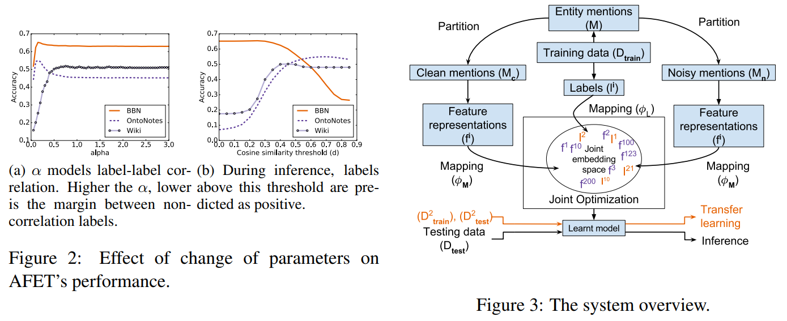
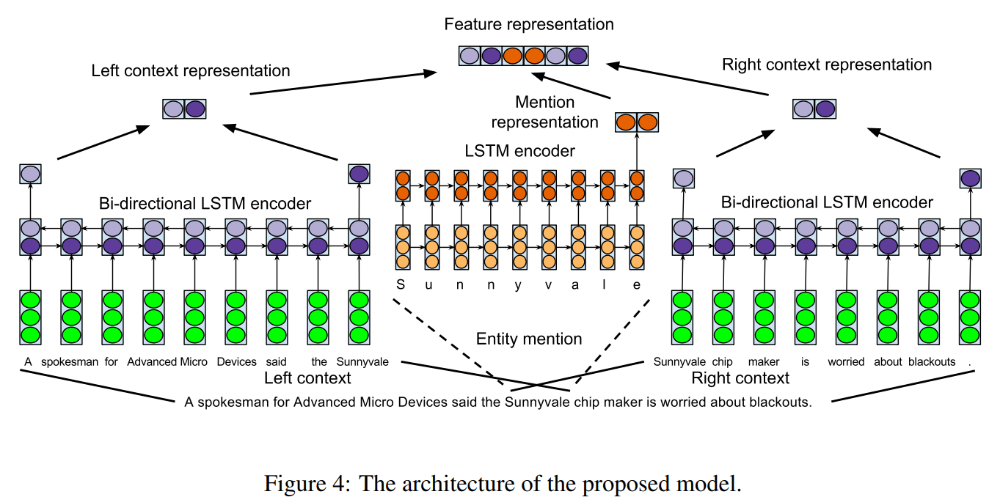

将训练数据分为干净和嘈杂。

共同学习实体提及及其上下文表示

克服了这两个缺点：假设训练数据无噪声，并且使用手工制作的特征

在AFET上改进损失函数,使用**两个不同的损失函数**来对干净和嘈杂的实体提及进行建模

将特征表示和标签嵌入到同一维空间中

 <!--more-->

# Abstract  

现有的FETC系统有两个主要缺点：假设训练数据无噪声，并且使用手工制作的特征。  我们的工作克服了这两个缺点。 我们提出了一个神经网络**共同学习实体提及及其上下文表示的模型**，以消除对手工特征的使用。 我们的模型将训练数据视为嘈杂，并使用(non-parametric variant of hinge loss function  )合页损失函数的非参数变量的变体。

# 1 Introduction  

现有的FETC系统具有以下一个或两个缺点：

- 假设训练数据无噪声 (Ling and Weld, 2012; Yosef et al., 2012; Yogatama et al., 2015; Shimaoka et al., 2016)

- 使用手工制作的特征 (Ling and Weld, 2012; Yosef et al., 2012; Yogatama et al., 2015; Ren et al., 2016)  

我们已经观察到，对于现实世界的数据集，超过25％的训练数据具有嘈杂的标签。 第一个缺点是**将训练数据中的这种噪声传播到FETC模型**。 为了提取手工制作的功能，使用了各种NLP工具。 由于此类工具中不可避免地存在错误，因此**第二个缺点就是将这些工具的错误传播到FETC模型。**

我们提出了一种基于神经网络的模型，以**克服现有FETC系统的两个缺点**。首先，我们使用与AFET系统相同的方法将训练数据分为干净和嘈杂。**对于这些划分，我们在训练时使用铰链损失函数的**简单而有效的非参数变量的变体。为了避免使用手工制作的功能，我们学习了给定实体提及及其上下文的表示。

此外，我们研究了在特征和模型级别上对FETC任务使用迁移学习的有效性。我们表明，特征level迁移学习可用于提高其他FETC系统（如AFET）的性能，其micro  F1分数最高可提高4.5％。类似地，模型级别的迁移学习可用于使用不同的数据集将同一模型的性能提高高达3.8％的micro-F1分数。
我们的贡献可以总结如下：

- 我们提出了一种简单的神经网络模型，该模型学习实体提及及其上下文的表示形式，并使用非参数铰链损失函数的变体来**合并嘈杂的标签信息**。在两个公开可用的数据集上的实验结果证明了该模型的有效性，micro  F1得分平均提高了2.69％。
- 我们研究在FETC任务领域中使用特征级别和模型级别的转移学习策略。提出迁移学习策略进一步改善了BBN数据集的最新水平（micro  F1评分提高了3.8％）。

# 2 Related Work  

Ling et al. (2012)  提出了第一个用于FETC任务的系统，该系统使用了112个重叠标签。 他们使用线性分类感知器进行多标签分类。Yosef et al. (2012) 在层次结构中使用多个二进制SVM分类器，以将实体提及分类为505种类型。 **最初的工作假设一个实体提及的训练数据集中存在的所有标签都是正确的**，但Gillick et al. (2014) **引入了上下文相关**的FETC，并提出了一组修剪标签的启发式方法，这些标签在实体提及当地情况的情况下可能不相关。 Yogatama et al. (2015)**提出了一个基于嵌入的模型**，其中用户定义的特征和标签被嵌入到低维特征空间中，以促进标签之间的信息共享。

Shimaoka et al. (2016)  提出了一个带注意力的神经网络模型，该模型**使用LSTM编码实体提及的上下文**的内容，并使用一种注意力机制使该模型专注于实体提及上下文中的相关表达。 但是，**该模型假定通过远程监管获得的所有标签都是正确**的。 相反，我们的模型并不假定所有标签都是正确的。 为了学习实体表示，我们提出了一种更简单但更有效的方案。

最近，Ren et al. (2016)   提出了一种FETC系统AFET。 AFET对干净和嘈杂的实体提及区分损失函数。AFET在其参数损失函数（模型参数$\alpha $）中使用通过给定数据获得的label-label 相关信息。 在推理期间，**AFET使用阈值将正类型与负类型分开**（相似性阈值参数$d$）。 但是，**AFET的损耗函数对参数的变化很敏感**，这取决于数据。 图2显示了参数$\alpha $和$d$对在不同数据集上评估的AFET性能的影响。 相反，我们的模型使用了铰链损失函数的一个简单而有效的变体。 **此功能不需要调整相似性阈值。**

# 3 The Proposed Model

## 3.1 Problem description  

训练语料库$\mathcal D_{train}$由一组句子组成，$S = \{s^i\}_{i=1}^N $。 每个句子$s^i$将具有一个或多个由$m^i_{j,k}$表示的实体提及，其中j和k分别表示开始标记和结束标记的索引。 集包含所有实体提及$m^i_{j,k}$。 对于每个实体提及$m^i_{j,k}$，将有一个对应的标签向量$l^i_{j,k}\in\{0,1\}^K $，它是一个二值向量，如果$t^{th}$类型为true，则$l^i_{j,k_t}$ = 1，否则它将为零。 K表示给定层次$\Psi $的标签总数。

## 3.2 Training set partition  

与AFET相似，我们将训练语料集$\mathcal D_{train}$的提及集$\mathcal M$分为两部分，一个集合$\mathcal M_c$仅由干净的实体提及组成，而集合$\mathcal M_n$仅由嘈杂的实体提及组成。如果一个实体提及$m^i_{j,k}$的标签$l^i_{j,k}$仅属于层次结构$\Psi $中的单个路径（不一定是叶节点），则表示它是干净的，也就是说，其标签明确； 否则是嘈杂的。 

## 3.3 Feature representations

**Mention representation:**  

We decompose an entity mention into character sequence, and use a vanilla **LSTM encoder**   

**Context representation:**   

The context representation described above is slightly different from what was proposed in (Shimaoka et al., 2016), here we **include entity mention** tokens within both left and right context, to explicitly encode context relative to an entity mention.

In the end, we concatenate entity mention and its context representation into a single Df dimensional vector, where $D_f = D_m + D_{lc} + D_{rc} $

use $f^i$ to denote feature representation for entity mention and its context obtained  

## 3.4 Feature and label embeddings  

Similar to Yogatama et al. (2015) and Ren et al. (2016), we embed feature representations and labels in a same dimensional space such that an object is embedded closer to the objects that sharesimilar types than the objects that do not. Formally, we are trying to learn linear mapping functions φM : RDf → RDe and φL : RDK → RDe,
where De is the size of embedding space. These
mappings are given by:  

**与 Yogatama et al. (2015)  Ren et al. (2016)类似**。 （2016年），我们**将特征表示和标签嵌入到同一维空间中**，这样一个对象被嵌入到共享相似类型的对象中，比不共享相似类型的对象之间的距离更近。 正式地，我们尝试学习线性映射函数$\phi \mathcal M :\mathbb R^{D_f} \rightarrow R^{D_e}$和  $\phi \mathcal L:\mathbb R^{D_K} \rightarrow R^{D_e}$.其中$D_e$是嵌入空间的大小。 这些映射由以下方式给出：$\phi_\mathcal M(f^i) =f^{i^T}U $$\phi_ \mathcal L(l^i_t) =l_t^{i^T}V$

其中，$U\in \mathbb R^{D^f \times D^e} $和$V\in \mathbb R^{D^K \times D^e} $分别是特征表示和类型标签的投影矩阵，而$l^i_t$是标签t的one-hot向量表示。

 我们为**每个标签类型t**和特征向量分配分数，分数是它们嵌入的点积。 正式地，我们将分数表示为：$s(f^i,l_t^i)=\phi_\mathcal M(f^i) \cdot \phi_ \mathcal L(l^i_t) $

## 3.5 Optimization  

我们使用**两个不同的损失函数**来对干净和嘈杂的实体提及进行建模。

 对于干净的实体提及，我们使用合页损失函数。 直觉很简单：在正负类型得分之间保持以零为中心的边距。 通过实体提及和标签类型（上式）之间的**相似度**来计算分数。 铰链损失功能有两个优点。 首先，它在推理过程中直观地将正负标签分开。 其次，它independent of data dependent parameter。 正式地，对于给定的实体提及$m_i$及其标签$l_i$，我们可以通过以下公式计算相关损失：

$L_c(m^i,l^i)=\sum_{t\in \gamma}max(0,1-s(m^i,l_t^i))+\sum_{t\in \bar \gamma}\max(0,1+s(m^i,l_t^i))$

式中，$\gamma$和$\bar \gamma$是分别表明是阳性还是阴性标签。

对于有噪声的实体，我们提出了一种**铰链损耗的变体**，其中，与$L_c$一样，所有负面标签的得分应低于-1。然而，对于阳性标签，由于我们不知道哪些标签与实体提及的本地上下文相关，我们建议给定的阳性标签集的最大得分应大于1。这在所有的否定类型和最相关的积极类型之间保持一个空白。形式上，噪声标签损失$L_n$定义为：

$L_n(m^i,l^i)=\sum_{t\in \bar \gamma}\max(0,1+s(m^i,l_t^i))+ max(0,1-s(m^i,l_{t^*}^i));$

$t^*=argmax_{t \in \gamma}s(m^i,l_t^i)$

同样，使用此损失函数可以直观地在推理过程中将阈值设置为零。

这些损失函数与(Yogatama et al., 2015; Ren et al., 2016)  中使用的损失函数的**不同之处在于**，我们制定了严格的绝对标准来区分正负标签。 而在（Yogatama等，2015； Ren等，2016）(Yogatama et al., 2015; Ren et al., 2016)  中，阳性标签的得分应高于阴性标签。**由于他们的得分是相对的，因此最终结果会因用于区分阳性和阴性标签的阈值而异**。为了一起训练划分的数据集，我们将联合目标问题公式化为：

$min_{\theta}O= \sum_{m \in \mathcal M_c} L_c(m,l)+\sum_{m \in \mathcal M_n}L_n(m,l)$

其中$\theta$是需要学习的所有模型参数的集合。 为了共同优化目标$O$，我们使用Adam，一种基于随机梯度的优化算法。

## 3.5 Optimization  