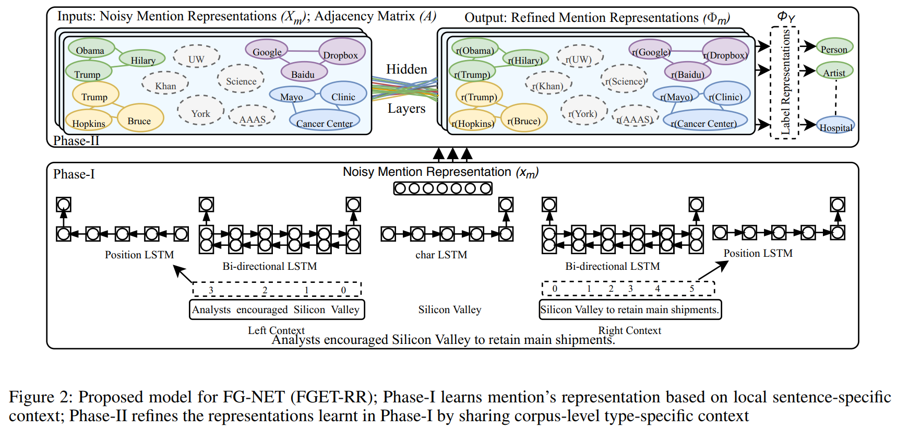

存在的缺点：仅根据提及的特定上下文不够，对于高度重叠或嘈杂的类型标签，这是不够的，因为它会阻止信息跨句子边界传递。clean sample（单类型路径）仍然也可能有噪声。对实体提及完全相互独立地建模。

方法：边缘加权的注意力图卷积网络，该网络通过在结束分类之前**加入语料库级别**的上下文线索来优化嘈杂的提及表示。

**Refined Mention Representations** 

Yogatama 使用嵌入技术来**共同嵌入实体提及和类型信息** 

AFET**联合嵌入（手工）特征向量和标记向量**

<!--more-->

# Fine-Grained Named Entity Typing over Distantly Supervised Data Based on Refined Representations

# Abstract  

细粒度命名实体键入（FG-NET）是自然语言处理（NLP）中的关键组件。它旨在将实体提及分类为多种实体类型。由于实体类型很多，因此，远程监督用于收集此任务的训练数据，该方法会嘈杂地将类型标签分配给实体提及，而与上下文无关。为了减轻嘈杂的标签，FG-NET上的现有方法**独立**地分析实体的提及，并**仅**根据提及句子的**特定上下文**分配类型标签。**对于高度重叠和/或嘈杂的类型标签，这是不足够的，因为它会阻止信息跨句子边界传递。** 为此，我们提出了一种**边缘加权的注意力图卷积网络**，**该网络通过在结束分类之前加入语料库级别的上下文线索来细化嘈杂的提及表示**。 实验评估表明，所提出的模型优于现有研究，macro-f1 和 micro-f1   的相对得分分别高10.2％和8.3％

# 1 Introduction  

为了处理嘈杂的训练数据，有关FG-NET的现有研究依赖于以下不同方法：（i）假设所有标签都是正确的（Ling and Weld 2012; Yogatama, 2015  ），这严重影响模型性能； （ii）应用不同的剪枝启发法来修剪嘈杂的标签（Gillick etal. 2014  ），但是，这些启发法极大地减少了训练数据的规模； （iii）将训练数据分为两类：clean（如果类型标签对应于相同的类型路径）和 noisy（其他类型（Ren et al. 2016a; Abhishek 2017 ），他们**忽略了标签（甚至对应于相同类型路径）仍然也可能有噪声的事实**。对于这些方法，很难保证基本的**建模假设将对减轻标签噪声产生重大影响**。另外，这些方法**对实体提及完全相互独立地建模**，这**阻碍了有关标签的特定上下文信息在嘈杂的实体提及之间的有效传播。**

为了解决与嘈杂训练数据相关的挑战，我们引入了一种新颖的方法，该方法除了sentence-specific  的上下文外，还同等重视分析关于label-specific  的corpus-level  上下文的实体提及。 具体来说，我们提出了(FGET-RR),  如图2所示。FGET-RR最初使用提及sentence-specific  的上下文来生成嘈杂的提及表示形式（Phase-I）。 随后，它使用corpus-level 上下文线索以形成一个稀疏图，该图围绕着一个嘈杂的提及子集，以及一系列具有高度上下文重叠的确定(confident )提及。 并且执行边缘加权的注意力图卷积，以**重新计算/优化嘈杂提及的表示**，将其表示为位于多跳处的自信邻居提及的集合（Phase-I）。 最后，将改进的提及表示与类型标签表示形式一起嵌入，以进行实体键入。

我们认为，提出的框架具有以下优点：（i）通过在嘈杂的提及中有效传播语料库级别的上下文线索，可以实现适当的信息共享； （ii）分析聚合的label-specific  上下文，与嘈杂的mention-specific 上下文相比，该上下文更加精细； （iii）它有效地关联了本地（sentence-level  ）和全局（corpus-level ）上下文以完善提及的表示方式，从而以健壮的方式执行最终任务。我们将本文的主要贡献总结如下：

- 我们引入了FGET-RR，这是一种FG-NET的新颖方法，除了sentence-level  上下文，它**同等重视与corpus-level  上下文有关的实体提及**，来以增强性能的方式执行实体键入。
- 我们提出了一种**边缘加权的注意力图卷积网络，以优化嘈杂的提及表示**。 据我们所知，这**是第一项工作**，与现有模型相比，该模型在模型输入时对数据进行了降噪处理，从而改进了在远距离监督数据中学习到的表示形式。
- 我们通过综合实验证明了所提出模型的有效性。 就macro-f1 和 micro-f1  分数而言，FGET-RR分别比现有研究高出10.2％和8.3％

# 2 Related Work  

NET的早期研究依赖于为少数实体提及分配实体类型（即人，位置，组织等）。在最近的十年中，传统的NET扩展到了广泛的细粒度实体类型（Ling and Weld 2012;Yosef et al. 2013  ）。 FG-NET中的所有系统主要**只关注实体类型**，即它们假定提及边界已预先确定。 Yogatama (2015) 使用嵌入技术来**共同嵌入实体提及和类型信息**。 Gillick et al., (2014)   提出了剪枝启发式方法，以修剪嘈杂的内容。 Corroet al., (2015)  介绍了迄今为止最细粒度的系统，其类型包括Word-Net层次结构。Ren et al., (2016a)   引入了AFET的方法，该方法使用一组手工制作的特征来表示提及，随后联合嵌入特征向量和标记向量以进行分类。 

Shimaoka et al., (2016)   使用平均编码器对实体提及进行编码，使用双向LSTM对上下文进行编码，然后注意关注label-specific 的上下文。Inui et al., (2017)   通过**结合手工特征**和注意力进行了扩展。 Abhishek（2017）使用**端到端架构**来编码实体提及及其上下文。Xu andBarbosa, (2018)   将FG-NET问题定义从多标签分类修改为具有分层感知损失的单标签分类问题，以处理噪声数据。Xin et al., (2018)   提出了基于语言模型的FG-NET，该模型计算类型标签和上下文之间的兼容性，以消除不一致的类型。

图卷积网络（GCN）近年来受到了相当多的研究关注。 GCN将卷积从规则网格扩展到空间域和/或频谱域中的图结构数据。它们被广泛用于分类设置中，即半监督和监督。虽然GCN已成功用于图像降噪(Valsesia, Fracastoro, and Magli 2019) [^1]，但我们是第一个有效**利用它来优化从嘈杂文本数据中学到的表示。**

# 3 The Proposed Model

## 3.1 Problem Definition  

在本文中，我们旨在构建一个多标签，多分类类实体键入系统，该系统可以使用远程监督的数据根据上下文将一个实体提及分类为一组细粒度的实体类型。 具体来说，我们会在实体类型分类之前优化从噪声数据中学到的表示形式。与现有研究（用于表1中的比较评估）类似，我们假设通过远程监督获得的训练数据$D_{train}$和手动标记的测试数据$D_{test}$是可用的。形式上，数据集$D$是一组句子/段落，其中实体提及fmigN i = 1（与实体相对应的标记），上下文fcigNi = 1和候选类型标签fyigNi = 1 2 f0； 1gY
（如果第t个类型对应于真标签，则为y; t = 1的Y维二元向量，否则为零）。在此，类型标签对应于知识库中具有架构Y的类型层次结构。我们将数据表示为一组三元组D = f（mi; ci; yi）gN i = 1。接下来（Ren et al.2016a），我们将训练内容分为Mtrain分为干净的Mclean和嘈杂的Mnoisy
提及的类型路径是否对应于一条路径
Y或其他形式。例如，考虑图1（b）中的类型路径，带有标签fperson，运动员，authorg的提及将被认为是嘈杂的，而带有标签fperson，artistg的提及将被视为是干净的。

# References

[^1]:Valsesia, Deep graph-convolutional image denoising.  abs/1907.08448.2019. CoRR