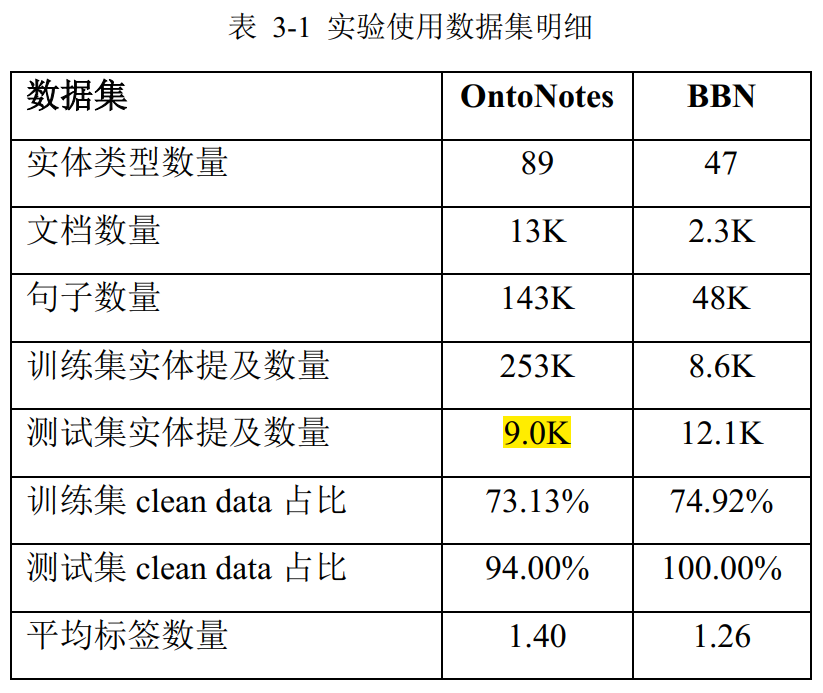
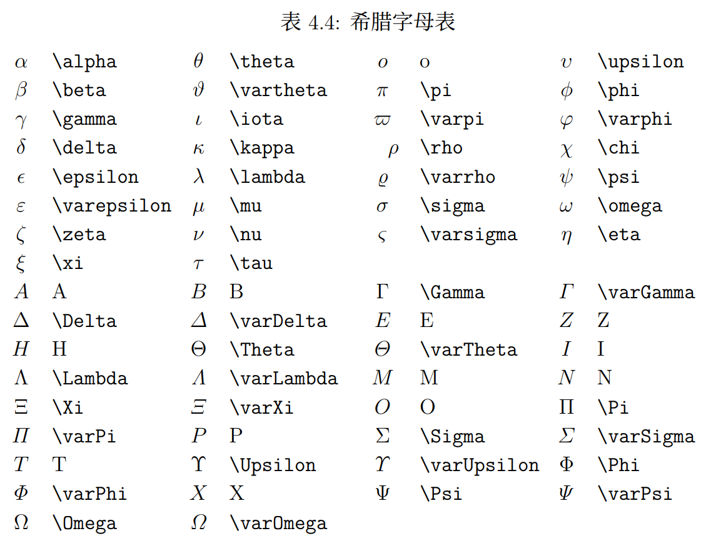
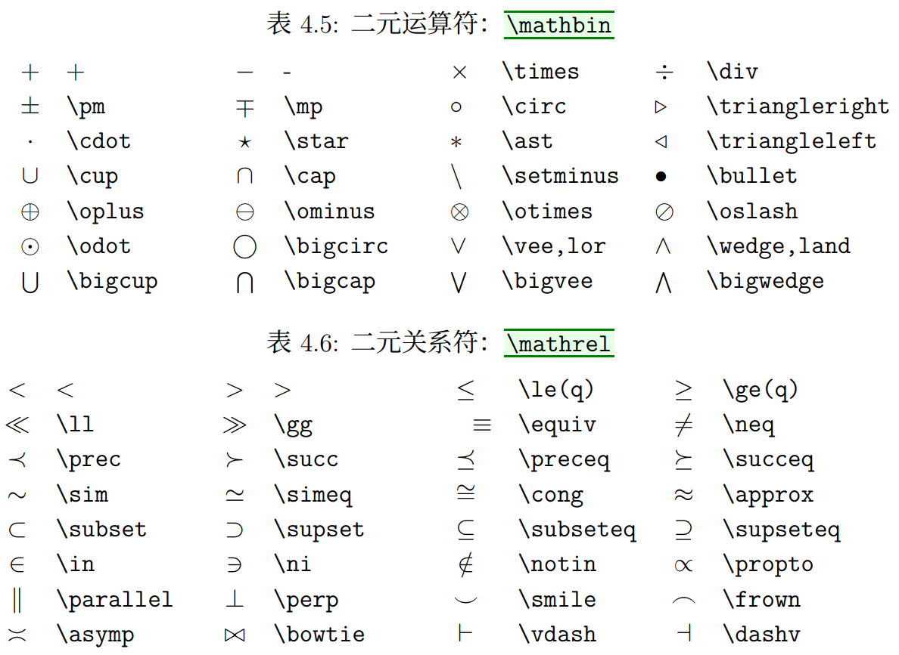
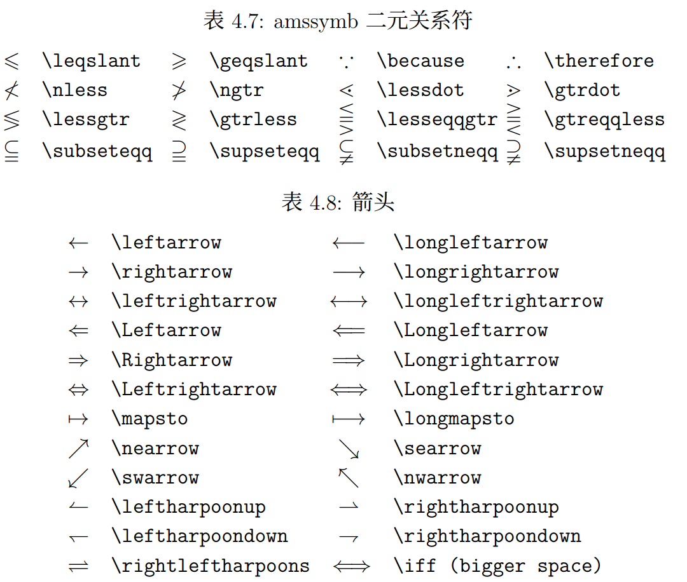
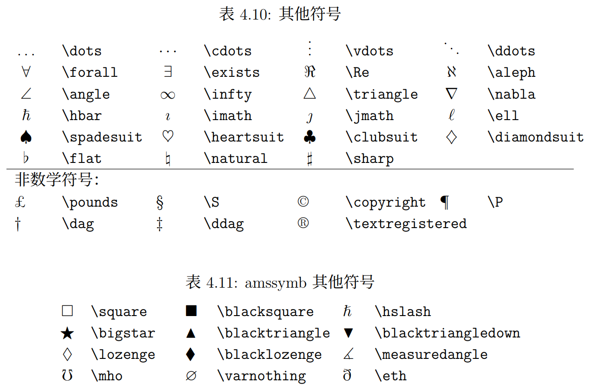

$\bar b  $ 

$\tilde b$

$\hat b$ 

$\dot b$

$\mid$

$\vec b$

$\dot a$

$\exp_a b = a^b, \exp b = e^b, 10^m$

$\ln c, \lg d = \log e, \log_{10} f$

$\sin a, \cos b, \tan c, \cot d, \sec e, \csc f$

$\min(x,y), \max(x,y)$

$lim_{x \to \infty} \frac{1}{n(n+1)}$

$\oplus, \ominus, \otimes, \oslash, \odot$

$\times, \div, \divideontimes, /, \backslash$

$\cdot, * \ast, \star, \circ, \bullet$

$\tau$

$\mathbb R$

$\left|-2\right|$

$\lvert-2\rvert$ 

$\mathcal{ABCDEFGHI}$

$\mathcal{JKLMNOPQR}$

$\mathcal{STUVWXYZ}$

$\mathbb{JKLMNOPQR}$

$\Psi $

$\mathcal{ABCDEFGHI}$

$\mathcal{JKLMNOPQR}$

$\boldsymbol{\alpha\beta\gamma\delta\epsilon\zeta\eta\theta}$

$\boldsymbol{\iota\kappa\lambda\mu\nu\xi\pi\rho}$

$\boldsymbol{\sigma\tau\upsilon\phi\chi\psi\omega}$

$\boldsymbol{\varepsilon\digamma\varkappa\varpi}$

$\boldsymbol{\varrho\varsigma\vartheta\varphi}$

$\rightarrow \to, \nrightarrow, \longrightarrow$


$\leftarrow \gets, \nleftarrow, \longleftarrow$


$\leftrightarrow, \nleftrightarrow, \longleftrightarrow$

$\color \teal 颜色$  $\color \red {颜色}$ $\color \green 颜色$ $\color \navy 颜色$ $\color \fuchsia 颜色$
$\color \blue 颜色$  $\color \blue 颜色$  $\color \olive 颜色$  $\color \purple 颜色$ 





# [LaTeX数学符号 ](https://www.mohu.org/info/symbols/symbols.htm)

# [LaTeX公式手册](https://www.cnblogs.com/1024th/p/11623258.html)

[Latex各种命令、符号、公式、数学符号、排版等](https://blog.csdn.net/QFire/article/details/81382048)

[用LaTeX 插入数学公式](https://blog.csdn.net/happyday_d/article/details/83715440)

[Latex基本表格绘制](https://blog.csdn.net/juechenyi/article/details/77116011)
[LaTeX手册](https://www.moonpapers.com/manual/latex/basic/)














注意表格内部换行，需要在文件定义部分加入...

```latex
\newcommand{\tabincell}[2]
  {
          \begin{tabular}
          {@{}#1@{}}#2
          \end{tabular}
  }
```

\Checkmark    %标准的勾  

\XSolid             %标准的叉  ----------------  \XSolidBrush   %加粗 \CheckmarkBold  \XSolidBold

\\\ 表示换行

１、指数和下标可以用^和_后加相应字符来实现。比如：


2、平方根（square root）的输入命令为：\sqrt，n 次方根相应地为: \sqrt[n]。方根符号的大小由LATEX自动加以调整。也可用\surd 仅给出
符号。比如：


3、命令\overline 和\underline 在表达式的上、下方画出水平线。比如：


4、命令\overbrace 和\underbrace 在表达式的上、下方给出一水平的大括号。


5、向量（Vectors）通常用上方有小箭头（arrow symbols）的变量表示。这可由\vec 得到。另两个命令\overrightarrow 和\overleftarrow在定义从A 到B 的向量时非常有用。


6、分数（fraction）使用\frac{...}{...} 排版。一般来说，1/2 这种形式更受欢迎，因为对于少量的分式，它看起来更好些。


7、积分运算符（integral operator）用\int 来生成。求和运算符（sum operator）由\sum 生成。乘积运算符（product operator）由\prod 生成。上限和下限用^ 和_来生成，类似于上标和下标。


## 以下提供一些常用符号的表示方法


