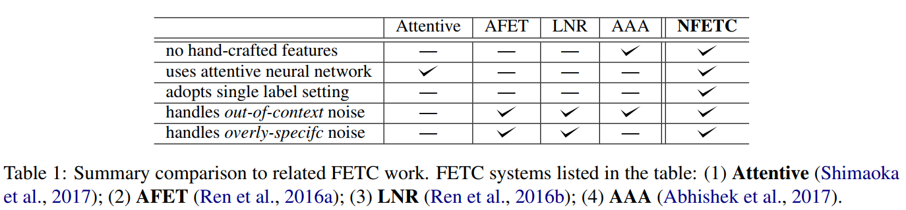

改进的缺点：out-of-context or overly-specific 、进行了临时的后处理。学习分类器时，平等且独立地对待每个类型标签，并忽略类型之间可能的关联性(overly-specific )。

方法：variant of crossentropy loss function 、hierarchical loss normalization 、共同学习实体提及及其上下文的表示。

将多标签分类问题转换为单标签分类

可以改进的点：每个提及可能不只有一个类型路径

嵌入到低维特征空间中，以**促进标签之间的信息共享**。

<!--more-->

# Neural Fine-Grained Entity Type Classification with Hierarchy-Aware Loss  

# Abstract  

细粒度实体类型分类（FETC）的任务包括将层次结构中的类型分配给文本中的实体提及。现有的方法依赖于远程监督，因此容易受到嘈杂的标签的影响，这些标签对于训练句子而言可能是上下文无关或过于具体的（out-of-context or overly-specific  ）。以前尝试解决这些问题的方法都是通过启发式方法或在手工制作标签的帮助下完成的。相反，我们提出了一种使用神经网络模型的端到端解决方案，该模型使用交叉熵损失函数的变体（variant of crossentropy loss function  ）来处理上下文无关标签和分层损失规范化（hierarchical loss normalization ） 来处理overly-specific标签。此外，先前的工作解决FETC的多标签分类问题之后**进行了临时的后处理**（ad-hoc post-processing ）。 相比之下，我们的解决方案则更为优雅：我们使用公共词嵌入来训练单标签，从而共同学习实体提及及其上下文的表示。 我们通过实验表明，我们的方法具有强大的抗噪声能力，并且在确定的任务基准上始终优于最新技术。

# 1 Introduction  

细粒度实体类型分类（FETC）旨在在上下文中使用一种或多种特定类型对实体中的提及进行标记（例如，actor  是artist  的子类型，而artist  又是person的子类型）。细粒度类型可在许多应用中提供帮助，包括关系提取，问题解答，实体链接，知识库完成，和实体推荐。由于用细粒度类型标记大型训练语料库的成本很高，因此当前的FETC系统求诸于远程监督（Mintz等人，2009）[^1]，并在知识库中用与实体相关联的所有类型在训练语料库中进行标注。直接远距离监督会导致嘈杂的训练数据，这可能会损害FETC模型。

远程监督引入的一种噪音是为句子分配上下文无关的标签。当前的FETC系统**通过忽略上下文无关的标签或使用简单的启发式剪枝方法来绕过该问题**。（例如丢弃在知识图谱中将具有分配给多种类型的实体的训练示例）。但是，这两种策略都很不完善，而且会影响准确性。远程监管引入的另一种噪声源是该类型对于上下文过于具体。由于现有知识图**更多地关注具有更多特定类型的显著实体**，因此过于具体的标签将模型偏向于流行的子类型而不是通用的子类型，即更喜欢运动员而不是人。大多数现有的FETC系统没有纠正这种偏差，而是忽略了该问题，并且平等且独立地对待每种类型，而忽略了许多类型在语义上的相关性。

除了无法处理嘈杂的训练数据外，我们试图解决先前FETC方法的另外两个局限性。 首先，它们依赖于从各种NLP工具产生的手工制作的特征。 因此，这些工具引入的不可避免的错误会通过训练数据传播到FETC系统。 二，以前的系统将FETC视为多标签分类问题：在类型推断过程中，他们预测每种类型的合理性评分，然后**将评分高于阈值的类型分类**（Mintz et al., 2009; Gillick et al., 2014; Shimaoka et al., 2017 ）或**在给定的类型层次结构中执行自上而下的搜索**（Ren et al., 2016a; Abhishek et al., 2017 ）。

**Contributions:**  我们提出了一种基于神经网络的模型，以克服上述现有FETC系统的缺点。 通过使用公开可用的词嵌入作为输入，我们学习了**两种不同的实体表示形式**，并使用双向长期短期记忆（LSTM）来学习上下文表示形式。 我们提出了一种交叉熵损失函数在训练阶段自动处理上下文无关的标签。 此外，我们引入了层次损失归一化来调整相关类型的惩罚，使我们的模型能够理解类型的层次结构并减轻标签过于具体的负面影响。

此外，为了简化该问题并利用先前对分层分类的研究，我们**将多标签分类问题转换为单标签分类**问题。 基于这样的假设：**根据上下文，每个提及只能有一个类型路径**，我们利用以下事实：类型层次结构是森林，**并通过终端类型（可能不是叶节点）唯一地表示每个类型路径**。 例如，类型路径root-person-coach可以仅表示为coach，而root-person可以明确表示为非叶子person  。

最后，我们报告了根据现有基准进行的最新技术实验验证，结果表明我们的模型**可以适应训练数据中的噪声**，并且始终优于以前的方法。 总而言之，我们描述了一个单一的，更简单和更优雅的神经网络模型，该模型尝试FETC**端对端而没有后处理或手工特征**，并改进了该任务的sota。

# 2 Related Work

**Fine-Grained Entity Type Classification:**   Ling第一个使用远程监督（Mintz等人，2009）[^1]来产生大型但嘈杂的训练集并手动标注明显较小的数据集以评估其FETC系统的工作。（2012），他同时引入了训练和评估数据集FIGER（GOLD）。他们使用线性分类器感知器进行多标签分类。虽然最初的工作在很大程度上假定了提及任务可以独立于提及的上下文来完成，Gillick et al. (2014)  [^2] 引入了上下文相关FETC的概念，其中提及的类型被限制为可以从上下文中推断出的内容，并引入了一个新的OntoNotes-derived  的手动标注评估数据集。此外，他们还解决了远程监督引起的标签噪声问题，并提出了三种标签清洗启发式方法。Yogatama et al. (2015)  [^3]提出了一个基于嵌入的模型，其中用户定义的特征和标签被嵌入到低维特征空间中，以**促进标签之间的信息共享**。

Ma et al. (2016) [^4 ]提出了一种标签嵌入方法，该方法结合了原型(prototypical  )和层次化信息，以学习经过预训练的标签嵌入，并采用了可以预测可见和先前未见实体类型的零次（zero-shot   ）框架。

Shimaoka et al. (2016) [^5]提出了一种attentive 神经网络模型，该模型使用LSTM编码实体提及的上下文，并使用一种注意力机制使模型专注于这种上下文中的相关表达。 Shimaoka等。Shimaoka et al. （2017）总结了FETC任务的许多神经架构。 **这些模型忽略了上下文无关的噪声**，也就是说，它们假设通过远程监督获得的所有标签都是正确的并且适用于训练语料库中的每个上下文。 在我们的论文中，提出了一个简单而有效的交叉熵损失函数的变体来处理上下文无关噪声问题。

Ren et al. (2016a)   提出了一种FETC系统AFET，该系统对干净和嘈杂的实体提及将损失函数分离，并在其参数损失函数中使用通过给定数据获得的标签相关信息。Renet al. (2016b)   引入了一种称为**LNR的方法来在不丢失数据的情况下减少标签噪音**。在FIGER（GOLD）和ontonotes的评估数据集上都有显著的性能提升。尽管这些工作同时考虑了上下文外噪声和过于特定的噪声，但它们**依赖于手工特征**，这成为进一步改善模型性能的障碍。 **对于LNR，由于降噪步骤与FETC模型是分开的，因此降噪引入的不可避免的误差将传播到FETC模型中**，这是不希望的。 在我们的FETC系统中，我们在模型内部无缝处理了无关噪声和过分特定的噪声引起的问题，并避免了使用手工特征。

最近，遵循AFET的想法，Abhishek et al. (2017)   提出了一种简单的神经网络模型，该模型**使用非参数合页损失函数**的变体合并了嘈杂的标签信息，并在FIGER（GOLD）上获得了很大的性能提升。 但是，他们的工作**忽略了过于具体的噪声的影响**，学习分类器时，平等且独立地对待每个类型标签，并忽略类型之间可能的关联性。

**Hierarchical Loss Function:**  由于FETC任务中存在固有类型分层，因此采用分层损失的想法很自然，调整FETC错误的惩罚具体取决于它们在层次结构中的位置。 对预测person  而不是athlete  的处罚应小于对预测organization 的处罚。 据我们所知，分层损失函数的首次使用最初是在使用支持向量机进行文档分类的上下文中引入的。 但是，**该工作假设将向领域专家征求控制分层损失的权重**，这不适用于FETC。 相反，我们提出了一种称为分层损失归一化的方法，该方法可以克服上述局限性，并与我们的神经体系结构中使用的交叉熵损失结合在一起。

表1汇总了我们的工作与先前的细粒度实体类型分类sota的最新比较。

# 3 Background and Problem

我们用一组基于提及的三元组代表训练语料:（$D={(m_i,c_i,y_i)}_{i=1}^N$）

我们将包括每个类型路径的所有终端类型的类型集表示为目标类型集$Y_i^t$。为了理解上下文外噪声的影响与训练集大小之间的权衡，我们报告了两种不同训练集的实验：仅对D进行过滤的三元组，其$Y_i$在D中形成单个类型路径 ，并使用所有三元组进行。 我们制定细粒度的实体分类问题如下：了理解上下文外噪声的影响之间的权衡以及训练集的大小，我们报告了使用两种不同训练集的实验：$D_{filtered}$仅包含三元组，其$Y_i$在$D$中形成单个类型路径，而$D_{raw}$具有所有三元组。 我们形式化细粒度的实体分类问题如下：

# References

[^1]:Mintz,2009.Distant supervision for relation extraction without labeled data.  ACL. 

[^2]: Gillick, 2014. Context dependent fine-grained entity type tagging. arXiv
[^3]:Yogatama, Gillick, 2015. Embedding methods for fine grained entity type classification. ACL (2) pages 291–296.  
[^4]:Ma, 2016. Label embedding for zero-shot fine-grained named entity typing. COLING 2016, 

[^5]:Shimaoka,2016. An attentive neural architecture for fine-grained entity type classification.arXiv .
[^6]:Shimaoka,  2017. Neural architectures for fine-grained entity type classification. (EACL).

