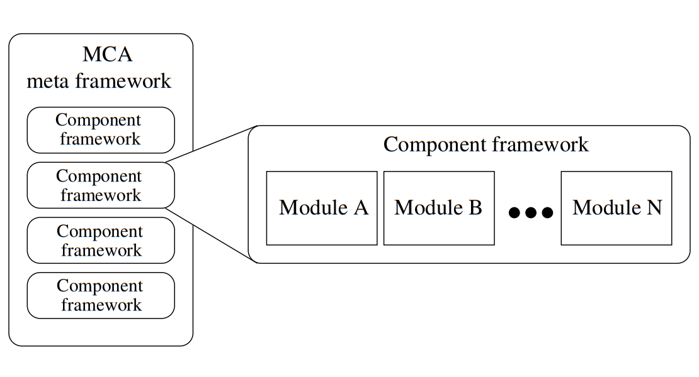

 网格和元计算(Grid and metacomputing )

MPI-2

Open MPI  OpenMP    MPI  

# Open MPI: Goals, Concept, and Design of a Next Generation MPI Implementation  

# Abstract

当前有大量的MPI实现，每种实现都强调高性能计算的不同方面，或者旨在解决特定的研究问题。结果是出现了许多不兼容的MPI实现，所有这些都需要单独安装，并且将它们的组合给最终用户带来了巨大的后勤挑战。基于以前的研究，并受LAM/MPI, LA-MPI, 和 FT-MPI   项目的代码库中经验的影响，Open MPI是一种**全新的**，生产质量的**MPI-2实现**，其基本是围绕**组件概念**。 Open MPI提供了新颖功能的独特组合，这些功能以前在MPI的开源，生产质量的实现中是不可获得的。它的组件体系结构既为第三方研究提供了一个稳定的平台，又使独立软件附件的运行时组合成为可能。本文概述了Open MPI的目标，设计和实现。

A large number of MPI implementations are currently available, each of which emphasize different aspects of high-performance computing or are intended to solve a specific research problem. The result is a myriad of incompatible MPI implementations, all of which require separate installation, and the combination of which present significant logistical challenges for end users. Building upon prior research, and influenced by experience gained from the code bases of the LAM/MPI, LA-MPI, and FT-MPI projects, Open MPI is an all-new, productionquality MPI-2 implementation that is fundamentally centered around component concepts. Open MPI provides a unique combination of novel features previously unavailable in an open-source, production-quality implementation of MPI. Its component architecture provides both a stable platform for third-party research as well as enabling the run-time composition of independent software add-ons. This paper presents a high-level overview the goals, design, and implementation of Open MPI.  

# 1 Introduction  

并行计算机体系结构的发展最近为并行应用程序开发人员和最终用户带来了新的趋势和挑战。 如今，由数以万计的处理器组成的系统已经面市。 预计在未来几年内将有十万个处理器系统。 单片高性能计算机因其更具吸引力的性价比而逐渐被PC和工作站集群取代。 但是，**此类集群提供的集成度较低**，因此与以前的体系结构相比，具有不同的I/O行为（并且通常具有较差的I/O行为）。 网格和元计算(Grid and metacomputing )的努力进一步提高了可用于并行应用程序的处理器数量，并增加了计算元素之间的物理距离。

The evolution of parallel computer architectures has recently created new trends and challenges for both parallel application developers and end users. Systems comprised of tens of thousands of processors are available today; hundred-thousand
processor systems are expected within the next few years. Monolithic highperformance computers are steadily being replaced by clusters of PCs and workstations because of their more attractive price/performance ratio. However, such clusters provide a less integrated environment and therefore have different (and often inferior) I/O behavior than the previous architectures. Grid and metacomputing efforts yield a further increase in the number of processors available to  parallel applications, as well as an increase in the physical distances between computational elements.

这些趋势为MPI实现带来了新的挑战。 使用数千个处理器的MPI应用程序面临许多**可扩展性问题**，这些问题会极大地影响任何并行应用程序的整体性能。 这些问题包括（但不限于）：进程控制，资源耗尽，等待时间感知和管理，容错以及针对常见通信模式的优化集体操作.(process control, resource exhaustion,latency awareness and management, fault tolerance, and optimized collective operations )

These trends lead to new challenges for MPI implementations. An MPI application utilizing thousands of processors faces many scalability issues that can dramatically impact the overall performance of any parallel application. Such issues include (but are not limited to): process control, resource exhaustion, latency awareness and management, fault tolerance, and optimized collective
operations for common communication patterns.  

在处理大规模计算时，不能忽略网络层传输错误（对于中等大小的集群而言，这是极不可能发生的）。 此外，并行应用程序在其运行期间遇到进程故障的可能性会随所使用的处理器数量的增加而增加。 如果应用程序要在过程故障中幸免而不必从头开始，则它**必须定期写入检查点文件**（并从最后一个一致的检查点重新启动应用程序），或者应用程序本身必须能够自适应地处理 运行时过程失败。 所有这些问题都是当前相关的研究主题。 实际上，不同的项目已经在各个级别上解决了一些问题。 但是，**目前还没有MPI实施能够全面解决所有问题。**

Network layer transmission errors—which have been considered highly improbable for moderate-sized clusters—cannot be ignored when dealing with largescale computations [4]. Additionally, the probability that a parallel application will encounter a process failure during its run increases with the number of processors that it uses. If the application is to survive a process failure without having to restart from the beginning, it either must regularly write checkpoint files (and restart the application from the last consistent checkpoint [1, 8]) or the application itself must be able to adaptively handle process failures during runtime [3]. All of these issues are current, relevant research topics. Indeed, some have been addressed at various levels by different projects. However, no MPI implementation is currently capable of addressing all of them comprehensively.  

这直接意味着**必须有一个新的MPI实施方案**：该方案能够提供一个框架来解决新兴网络和体系结构中的重要问题。 在以前的研究的基础上，并受LAM/MPI , LA-MPI , and FT-MPI 项目的代码库经验的影响，Open MPI是一种全新的生产质量 MPI-2实现。 Open MPI提供了新颖功能的独特组合，这些功能以前在MPI的开源，生产质量的实现中是不可用的。 它的**组件体系结构**既为前沿的第三方研究提供了一个稳定的平台，又使独立软件附件的运行时组合成为可能。

This directly implies that a new MPI implementation is necessary: one that is capable of providing a framework to address important issues in emerging networks and architectures. Building upon prior research, and influenced by experience gained from the code bases of the LAM/MPI [9], LA-MPI [4], and FT-MPI [3] projects, Open MPI is an all-new, production-quality MPI-2 implementation. Open MPI provides a unique combination of novel features previously unavailable in an open-source, production-quality implementation of MPI. Its component architecture provides both a stable platform for cutting-edge thirdparty research as well as enabling the run-time composition of independent software add-ons.  

## 1.1 Goals of Open MPI  

尽管所有参与机构在实施MPI方面都具有丰富的经验，但是Open MPI不仅仅是LAM / MPI，LA-MPI和FT-MPI的简单合并。尽管受以前的代码库影响，但Open MPI是消息传递接口的**全新实现**。该软件着重于生产质量性能，实现了完整的MPI-1.2 [6]和MPI-2 [7]规范，并完全支持并发的多线程应用程序（即MPI THREAD MULTIPLE）。

While all participating institutions have significant experience in implementing MPI, Open MPI represents more than a simple merger of LAM/MPI, LA-MPI and FT-MPI. Although influenced by previous code bases, Open MPI is an allnew implementation of the Message Passing Interface. Focusing on productionquality performance, the software implements the full MPI-1.2 [6] and MPI-2 [7] specifications and fully supports concurrent, multi-threaded applications (i.e., MPI THREAD MULTIPLE).

为了有效地支持各种并行机，目前正在开发用于所有已建立互连的高性能“驱动程序”。这些包括TCP / IP，共享内存，Myrinet，Quadrics和Infiniband。根据用户，市场和研究需求，可能会增加对更多设备的支持。对于网络传输错误，Open MPI提供了用于检查数据完整性的可选功能。通过利用消息分段和在多个（可能是异构的）网络设备上进行条带化，Open MPI既可以最大化应用程序可实现的带宽，又可以在节点配备多个网络接口时动态处理网络设备的丢失。因此，网络故障转移的处理对应用程序是完全透明的。

To efficiently support a wide range of parallel machines, high performance “drivers” for all established interconnects are currently being developed. These include TCP/IP, shared memory, Myrinet, Quadrics, and Infiniband. Support for more devices will likely be added based on user, market, and research requirements. For network transmission errors, Open MPI provides optional features for checking data integrity. By utilizing message fragmentation and striping  over multiple (potentially heterogeneous) network devices, Open MPI is capable of both maximizing the achievable bandwidth to applications and providing the ability to dynamically handle the loss of network devices when nodes are equipped with multiple network interfaces. Thus, the handling of network failovers is completely transparent to the application.

Open MPI的运行时环境将提供基本服务，以在交互式和非交互式环境中启动和管理并行应用程序。在可能的情况下，将利用现有的运行时环境来提供必要的服务；在此类服务尚不可用的情况下，将使用基于用户级守护程序的可移植运行时环境。

The runtime environment of Open MPI will provide basic services to start and manage parallel applications in interactive and non-interactive environments. Where possible, existing run-time environments will be leveraged to provide the necessary services; a portable run-time environment based on user-level daemons will be used where such services are not already available.  

## 2 The Architecture of Open MPI

​								图1. Open MPI的三个主要功能区域：MCA，其组件框架以及每个框架中的模块。

Open MPI设计围绕MPI组件体系结构（MCA）。 虽然组件编程在工业中得到了广泛使用，但直到最近才在高性能计算社区中得到认可[2，9]。 如图1所示，Open MPI包含三个主要功能区域：

- MCA：骨干组件体系结构，为所有其他层提供管理服务；
- 组件框架：Open MPI中的每个主要功能区域都有一个相应的后端组件框架，用于管理模块；
- 模块：独立的软件单元，可导出定义明确的接口，这些接口可在运行时进行部署并与其他模块组成。

The Open MPI design is centered around the MPI Component Architecture (MCA). While component programming is widely used in industry, it is only recently gaining acceptance in the high performance computing community [2, 9]. As shown in Fig. 1, Open MPI is comprised of three main functional areas:

- MCA: The backbone component architecture that provides management services for all other layers;
- Component frameworks: Each major functional area in Open MPI has a corresponding back-end component framework, which manages modules;
- Modules: Self-contained software units that export well-defined interfaces that can be deployed and composed with other modules at run-time.  

MCA管理组件框架并为其提供服务，例如能够接受来自高层抽象（例如mpirun）的运行时参数，并将其通过组件框架向下传递到各个模块。 MCA还在构建时找到组件，并调用它们相应的挂钩以进行配置，构建和安装。

The MCA manages the component frameworks and provides services to them, such as the ability to accept run-time parameters from higher-level abstractions (e.g., mpirun) and pass them down through the component framework to individual modules. The MCA also finds components at build-time and invokes their corresponding hooks for configuration, building, and installation.

每个组件框架都专用于单个任务，例如提供并行作业控制或执行MPI集合操作。根据需求，框架将发现，加载，使用和卸载模块。每个框架都有不同的策略和使用场景。有些将一次仅使用一个模块，而另一些将同时使用所有可用模块。

Each component framework is dedicated to a single task, such as providing parallel job control or performing MPI collective operations. Upon demand, a framework will discover, load, use, and unload modules. Each framework has different policies and usage scenarios; some will only use one module at a time while others will use all available modules simultaneously.

模块是独立的软件单元，可以自行配置，构建和安装。模块遵守其所属的组件框架规定的接口，并向更高级别的层和MPI的其他部分提供请求的服务。

Modules are self-contained software units that can configure, build, and install themselves. Modules adhere to the interface prescribed by the component framework that they belong to, and provide requested services to higher-level tiers and other parts of MPI.

以下是Open MPI中的组件框架的部分列表（描述了MPI功能；本文不涉及运行时环境支持组件）：

The following is a partial list of component frameworks in Open MPI (MPI functionality is described; run-time environment support components are not covered in this paper):  

- 点对点传输层（PTL）：PTL模块对应于特定的网络协议和设备。 PTL模块主要负责MPI进程之间移动字节的“有线协议”，不了解MPI语义。可以在单个过程中使用多个PTL模块，从而允许使用多个（可能是异构的）网络。支持TCP / IP，共享内存，Quadrics elan4，Infiniband和Myrinet的PTL模块将在第一个Open MPI版本中提供。

- 点对点管理层（PML）：PML的主要功能是在MPI层与所有可用PTL模块之间提供消息分段，调度和重组服务。有关PML和PTL模块的更多详细信息，请参见[11]。

- 集体通信（COLL）：MPI集体操作的后端，同时支持内部和内部通信器功能。当前阶段计划了两个集体模块：一个实现线性和对数算法的基本模块，一个使用类似于MagPIe项目[5]中使用的分层算法的模块。

- 流程拓扑（TOPO）：内部通信者的笛卡尔和图形映射功能。基于群集和基于网格的计算可能会受益于可感知拓扑的通信器，从而使MPI可以基于位置来优化通信。

- 归约运算：用于MPI的固有归约运算（例如MPI SUM）的后端功能。模块可以利用专用指令集来在目标平台上优化性能。

- 并行I/O：I/O模块实现并行文件和设备访问。许多MPI实现都使用ROMIO [10]，但其他软件包可能适用于本机使用（例如，基于群集和基于并行的文件系统）。

- Point-to-point Transport Layer (PTL): a PTL module corresponds to a particular network protocol and device. Mainly  responsible for the “wire protocols” of moving bytes between MPI processes, PTL modules have no knowledge of MPI semantics. Multiple PTL modules can be used in a single process, allowing the use of multiple (potentially heterogeneous) networks. PTL modules supporting TCP/IP, shared memory, Quadrics elan4, Infiniband and Myrinet will be available in the first Open MPI release.

- Point-to-point Management Layer (PML): the primary function of the PML is to provide message fragmentation, scheduling, and re-assembly service between the MPI layer and all available PTL modules. More details to the PML and the PTL modules can be found at [11].
-  Collective Communication (COLL): the back-end of MPI collective operations, supporting both intra- and intercommunicator functionality. Two collective modules are planned at the current stage: a basic module implementing linear and logarithmic algorithms and a module using hierarchical algorithms similar to the ones used in the MagPIe project [5].
- Process Topology (TOPO): Cartesian and graph mapping functionality for intracommunicators. Cluster-based and Grid-based computing may benefit from topology-aware communicators, allowing the MPI to optimize communications based on locality.
- Reduction Operations: the back-end functions for MPI’s intrinsic reduction operations (e.g., MPI SUM). Modules can exploit specialized instruction sets for optimized performance on target platforms.
- Parallel I/O: I/O modules implement parallel file and device access. Many MPI implementations use ROMIO [10], but other packages may be adapted for native use (e.g., cluster- and parallel-based filesystems).  

各种各样的框架类型允许第三方开发人员将Open MPI用作研究平台，用于商业产品的部署工具，甚至用于不同算法和技术的比较机制。

The wide variety of framework types allows third party developers to use Open MPI as a research platform, a deployment vehicle for commercial products, or even a comparison mechanism for different algorithms and techniques. 

Open MPI中的组件体系结构为最终用户和库开发人员提供了多个优势。 首先，它允许在单个MPI流程中使用多个组件。 例如，一个进程可以同时使用多个网络设备驱动程序（PTL模块）。 其次，它提供了使用第三方软件的便利可能性，该第三方软件支持源代码和二进制发行版。 第三，它提供了一种细粒度，运行时，用户控制的组件选择机制。

The component architecture in Open MPI offers several advantages for endusers and library developers. First, it enables the usage of multiple components within a single MPI process. For example, a process can use several network device drivers (PTL modules) simultaneously. Second, it provides a convenient possibility to use third party software, supporting both source code and binary distributions. Third, it provides a fine-grained, run-time, user-controlled component selection mechanism.  

## 2.1 Module Lifecycle  

尽管每个框架都不同，但是COLL框架提供了MPI流程中模块的用法和生命周期的说明性示例：

1. 在MPI INIT期间，COLL框架查找所有可用的模块。模块可能已静态链接到MPI库，也可能是位于知名位置的共享库模块。
2. 查询所有COLL模块以查看它们是否要在进程中运行。模块可以选择不运行；例如，如果没有可用的Infiniband NIC，则基于Infiniband的模块可能会选择不运行。列表包含所有选择运行的模块-“可用”模块列表。
3. 创建每个通信器（包括MPI COMM WORLD和MPI-COMM SELF）时，将查询每个可用的模块，以查看是否要在新的通信器上使用。模块可能会被拒绝使用；例如，共享存储器模块仅在通信器中的所有进程都在同一物理节点上时才允许使用它。选择接受的最高优先级模块以用于该通信器。
4. 选择模块后，将对其进行初始化。该模块通常分配任何资源，并可能预先计算在调用集体操作时将使用的信息。
5. 在该通信器上调用MPI集合函数时，将调用模块相应的后端函数以执行该操作。

6. COLL模块生命周期的最后阶段是该通信器被破坏时。这通常需要释放资源以及与通信器相关联的任何预先计算的信息而被破坏。

Although every framework is different, the COLL framework provides an illustrative example of the usage and lifecycle of a module in an MPI process:

1. During MPI INIT, the COLL framework finds all available modules. Modules may have been statically linked into the MPI library or be shared library modules located in well-known locations.
2.  All COLL modules are queried to see if they want to run in the process. Modules may choose not to run; for example, an Infiniband-based module may choose not to run if there are no Infiniband NICs available. A list is made of all modules who choose to run – the list of “available” modules.
3. As each communicator is created (including MPI COMM WORLD and MPI - COMM SELF), each available module is queried to see if wants to be used on the new communicator. Modules may decline to be used; e.g., a shared memory module will only allow itself to be used if all processes in the communicator are on the same physical node. The highest priority module that accepted is selected to be used for that communicator.
4. Once a module has been selected, it is initialized. The module typically allocates any resources and potentially pre-computes information that will be used when collective operations are invoked.
5. When an MPI collective function is invoked on that communicator, the module’s corresponding back-end function is invoked to perform the operation.
6. The final phase in the COLL module’s lifecycle occurs when that communicator is destroyed. This typically entails freeing resources and any precomputed information associated with the communicator being destroyed.  

# 3 Implementation details  

讨论了Open MPI设计的两个方面：其面向对象的方法和模块管理的机制。

Two aspects of Open MPI’s design are discussed: its object-oriented approach and the mechanisms for module management.  

## 3.1 Object Oriented Approach  

使用简单的C语言面向对象的系统实现开放MPI，该系统具有单一继承和使用保留/释放模型的基于引用计数的内存管理。 “对象”由结构和单个实例化的“类”描述符组成。 结构的第一个元素必须是指向父类结构的指针。

Open MPI is implemented using a simple C-language object-oriented system with single inheritance and reference counting-based memory management using a retain/release model. An “object” consists of a structure and a singlyinstantiated “class” descriptor. The first element of the structure must be a pointer to the parent class’s structure.

宏用于实现类似C ++的语义（例如new，construct，destruct，delete）。 基于C ++的各种软件项目的经验以及某些平台上相应的编译问题的经验鼓励我们采用这种方法，而不是直接使用C ++。

Macros are used to effect C++-like semantics (e.g., new, construct, destruct, delete). The experience with various software projects based on C++ and the according compilation problems on some platforms has encouraged us to take this approach instead of using C++ directly.  

构造后，对象的参考计数将设置为1。 保留对象后，其引用计数就会增加； 当它被释放时，其参考计数减少。 当引用计数达到零时，将运行类的析构函数（及其父代的析构函数），并释放内存。

Upon construction, an object’s reference count is set to one. When the object is retained, its reference count is incremented; when it is released, its reference count is decreased. When the reference count reaches zero, the class’s destructor (and its parents’ destructor) is run and the memory is freed.  

## 3.2 Module Discovery and Management

Open MPI提供了三种用于将模块添加到MPI库（因此添加到用户应用程序）的机制：

- 在配置Open MPI的过程中，脚本会遍历构建树并生成找到的模块列表。 这些模块将被配置，编译并静态链接到MPI库。
- 同样，在配置过程中发现的模块也可以编译为已安装的共享库，然后在运行时重新发现。
- 不想提供其模块源代码的第三方库开发人员可以独立于Open MPI配置和编译其模块，并以二进制形式分发结果共享库。 用户可以将该模块安装到适当的目录中，Open MPI可以在运行时发现该模块。

Open MPI offers three different mechanisms for adding a module to the MPI library (and therefore to user applications):

- During the configuration of Open MPI, a script traverses the build tree and generates a list of modules found. These modules will be configured, compiled, and linked statically into the MPI library.
- Similarly, modules discovered during configuration can also be compiled as shared libraries that are installed and then re-discovered at run-time.
- Third party library developers who do not want to provide the source code of their modules can configure and compile their modules independently of Open MPI and distribute the resulting shared library in binary form. Users can install this module into the appropriate directory where Open MPI can discover it at run-time.  

在运行时，Open MPI首先“发现”静态链接到MPI库的所有模块。 然后，它会搜索几个目录（e.g., HOME/ompi/,INSTALLDIR/lib/ompi/, etc.）以查找可用的模块，并按框架类型对其进行排序。 为了简化运行时发现，共享库模块具有特定的文件命名方案，以指示其MCA组件框架类型和模块名称。

At run-time, Open MPI first “discovers” all modules that were statically linked into the MPI library. It then searches several directories (e.g., HOME/ompi/,INSTALLDIR/lib/ompi/, etc.) to find available modules, and sorts them by framework type. To simplify run-time discovery, shared library modules have a specific file naming scheme indicating both their MCA component framework type and their module name.

模块由其名称和版本号标识。 这使MCA可以管理同一组件的不同版本，从而确保一个MPI流程中使用的模块的名称和版本号与对等MPI流程中使用的模块相同。 有了这种灵活性，Open MPI提供了多种机制来选择给定的模块以及将运行时参数传递给模块：mpirun的命令行参数，环境变量，文本文件和MPI属性（e.g., on communicators）。

Modules are identified by their name and version number. This enables the MCA to manage different versions of the same component, ensuring that the modules used in one MPI process are the same—both in name and version number–as the modules used in a peer MPI process. Given this flexibility, Open MPI provides multiple mechanisms both to choose a given module and to pass run-time parameters to modules: command line arguments to mpirun, environment variables, text files, and MPI attributes (e.g., on communicators).  