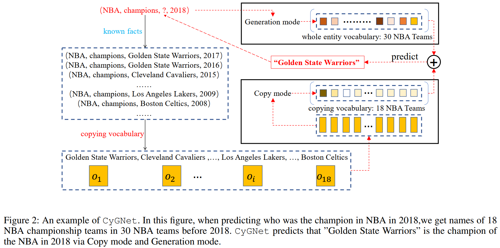
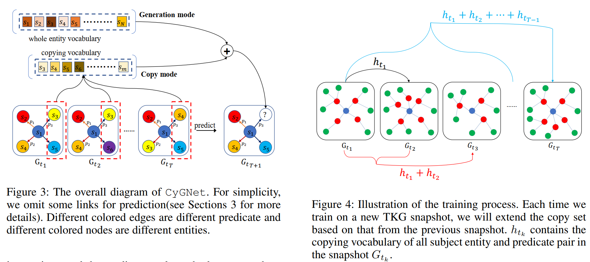

# 3 Method  

在本节中，我们介绍用于**TKG的链路预测**的模型CyGNet。 我们从符号开始。 然后，我们详细介绍了CyGNet的模型架构，以及其训练和推理过程。

# 3.1 Notations  

TKG将时间信息合并到传统KG中。 在TKG中，每个事实都在时间步骤$t \in \mathcal T$捕获了( subject and object)主体和客体实体$s \in \mathcal E$和$o \in \mathcal E$的关系（或谓词）$p \in \mathcal R$，其中$\mathcal {E,R}$分别表示对应的实体词汇和关系，$\mathcal T$是时间戳的集合。 $\mathcal G_t$是时间$t$ KG的快照。 $g=(s,p,o,t)$表示$\mathcal G_t$的四元组（事实）。TKG建立在一组事实四元组的基础上，事实四元组根据其时间戳升序排列，即$\mathcal {G=G_1,G_2,....,} \mathcal G_T$，并且删除了相同的四元组以去除冗余。 对于在时间步t的每个主实体—谓词对，我们将特定于$(s,p,t)$的$E$的限定子集（即$(s,p,t)$的复制词汇）定义为$H_{t_k}^{(s,p)}$，其中包含所有在事实中用作对象实体的实体，其中(subject )主实体$s$和关系（谓词）$p$沿着$t_k$之前的已知快照$\mathcal {G_{(t_1,t_k-1)}=G_1,G_2,....,G_{k-1} }$，其中复制词汇$H_{t_k}^{(s,p)}$是N维独热向量，而N是$\mathcal E$的基数，复制词汇表中的实体为1，其他为0。用给定的subject实体 object实体预测谓词$(s,?,o,t)$。 在不失一般性的前提下，我们将模型描述为在时间事实中预测缺少的object实体，尽管该模型可以轻松扩展到预测其他元素，包括object实体和关系（谓词）。

# 3.2 CyGNet  

如图3所示，我们的模型结合了两种处理模式，即(Copy mode and Generation mode  )“复制”模式和“生成”模式，前者试图从形成历史中重复事实的特定**复制词汇**中选择实体，而后者则根据**整个实体词汇**来预测实体。 当预测图3中的四元组$(s_1,p_3,?,T+1)$时，Copy mode复制模式可以获取复制词汇表$s_3,s_4,s_5,...,s_m$中的实体的概率，这些实体与subject实体$s_1$和关系$p_3$一起沿已知快照$\mathcal G_{(t_1,t_T)}$充当事实中的object实体。 生成模式估计整个实体词汇表中每个实体满足答案的概率。 然后CyGNet结合了“复制”模式和“生成”模式中的概率预测，以获得最终预测。

我们首先处理训练集以获得每个subject实体和谓词对$(s,p, t)$在任何快照中的复制词汇，即$\{H_{t_1}^{(s,p)}, H_{t_2}^{(s,p)},...,H_{t_T}^{(s,p)}\}$，其中$H_{t_k}^{(s,p)}$是N维one-hot向量，其中包含所有在事实中用作对象实体的实体，其中(subject )主实体$s$和关系（谓词）$p$沿着$t_k$之前的已知快照$\mathcal G_{t_k} $。 如图4所示，我们按顺序对每个快照进行训练，并且每次对新快照进行训练时，都将同时利用以前的所有快照作为复制词汇，这个过程在某种程度上类似于递归的想法。 当我们在验证集和测试集中评估CyGNet的性能时，将使用整个训练集中的复制词汇。 

对于每个四元组事实$(s,p,?,t_k)$，我们将从上一个快照扩展特定于$(s,p,t_k)$的复制词汇。 在形式上，复制词汇表述如下：$H_{t_k}^{(s,p)}=H_{t_1}^{(s,p)}+ H_{t_2}^{(s,p)}+...+H_{t_{k-1}}^{(s,p)}$

其中$H_{t_k}^{(s,p)}$是N维one-hot向量，复制词汇表中实体的值是1，其他值是0。

**Copy mode**  复制模式用于识别具有重复性的事实，并因此预测未来事实通过从历史中的已知事实中复制事实。

如果查询$(s,,p,?,t_k)$在时间步$t_k$具有与主实体和谓词对$(s,p,t_k)$有关的复制词汇$H_{t_k}^{(s,p)}$，CyGNet将增加在复制词汇表中选择的object实体的概率。 详细地说，复制模式首先使用多层感知器（MLP）生成索引向量$v_q$：

$v_q=ReLU(W_c[s,p]+b_c)$，

其中$W_c \in \mathbb R^{2d \times N}$和$b_c \in  \mathbb R^N$是可学习的参数。 该索引向量$v_q$是一个N维向量，因此N是整个实体词汇表$\mathcal E$的基数。它负责从$\mathcal E$中选择在$t_k$之前的已知快照$\mathcal G_{(t_1,t_{k-1})}$中与s和p形成已知事实的实体。

为了最小化某些未在历史记录中用s和p形成已知事实的实体(uninterested entities)（即对复制模式不感兴趣）的可能性，我们首先对$H_{t_k}^{(s,p)}$进行修改。$\dot H_{t_k}^{(s,p)}$将$H_{t_k}^{(s,p)}$中不感兴趣实体（uninterested entities）的值更改为很小的负数。

CyGNet通过将索引向量$v_q$和更改后的one-hot向量$\dot H_{t_k}^{(s,p)}$相加来限定候选空间，以最小化不感兴趣实体（uninterested entities）的概率，然后通过softmax层获得复制词汇中object实体的概率估计。

$c_q=v_q+\dot H_{t_k}^{(s,p)}$,

$p(c)=softmax(c_q)$

其中$c_q$是N维向量，$c_q$中不感兴趣的实体的值几乎接近零。 $\mathbb p$(c)是整个实体词汇尺寸向量，仅包含复制词汇量的概率。 概率 $\mathbb p$(c)的最大值是我们通过“复制”模式在复制词汇表中复制的object实体。 复制模式的重要优点是，您可以**从比整个实体词汇量更加有限的候选空间中学习预测**。但是，事实会在新快照中出现。 因此，我们需要一种生成模式来预测这样的事实。

**Generation mode**  

给定相同的查询$(s,p,?,t_k)$，Generation模型负责通过从整个实体词汇$\mathcal E$中选择object实体来预测事实。Generation模型进行的预测**将预测的事实视为新事实**，没有任何参考复制词汇$H_{t_k}^{(s_i,p_j)}$。 与复制模型相似，生成模型还生成整个实体词汇查询向量$g_q$，然后在整个实体词汇上使用softmax层预测object实体。

$g_q=\sigma(W_g[s,p,t_k]+b_g)$

$p(g)=softmax(c_g)$

其中$W_g \in \mathbb R^{2d \times N}$和$b_g \in  \mathbb R^N$是可学习的参数，而$\sigma$是ReLU函数。 像$g_q$的$v_q$维一样，它也等于实体词汇表$E$的基数。类似于复制模式下的$\mathbb p$(c)，$\mathbb p$(g)也是整个实体词汇表尺寸向量，其中包含整个实体词汇表的概率。 概率$\mathbb p$(g)的最大值是我们通过生成模型$\mathbb p$(c)在整个实体词汇中预测的object实体。 **生成模型可以解决复制模型无法预测新事实的问题**。

**3.3 Learning Objective**  

给定查询$(s,p,?,t)$时预测（object）实体可以看作是多分类任务，其中每个类对应一个object实体。 为了**学习实体，关系和时间（s,p,t）的权重和表示**，我们在训练过程中存在的TKG快照的所有事实上最小化以下交叉熵损失$\mathcal L$。

$\mathcal L=-\sum_{t\in T}\sum_{i\in E}\sum_{k=1}^K o_{it}ln p_t(y_{ik})$

其中$o_{it}$是快照$\mathcal G_t$中的第i个真实object实体，$p_t(y_{ik})$是当第i个真实object实体为$o_{i}$时快照$\mathcal G_t$中第k个object实体的概率值。

**3.4 Inference**  

在不失一般性的前提下，我们将推理过程描述为在时间事实中预测丢失的(object)对象，尽管此过程可以轻松扩展到预测包括(subject and the relation)主体和关系在内的其他元素。 为了对查询$（s,p,？,t_k）$进行预测，每个复制和生成模型都**以候选空间的最高概率给出其对（object）对象实体的预测**，其中**复制模型可从比整个实体词汇表小的候选空间进行预测**。 为了确保$\mathcal E$中所有实体的概率之和等于1，我们定义一个系数$\alpha$，该系数可调整复制模型和生成模型之间的权重。 **CyGNet通过add这两种模式给出的每个实体的概率，将复制模型和生成模型中的概率预测相结合。 最终预测$o_t$将是接收最高组合概率的实体**，如下所示：

$\textbf p(o|s,p,t)=\alpha*\textbf p(c)+(1-\alpha)*\textbf p(g)$,

$o_t=argmax_{o\in E}\textbf p(o|s,p,t)$,

其中$\alpha \in [0,1]$。$\textbf p(o|s,p,t)$是整个实体词汇表尺寸向量，其中包含所有实体的概率。 概率$\textbf p(o|s,p,t)$中的最大值是我们预测的目标object实体$o_t$。