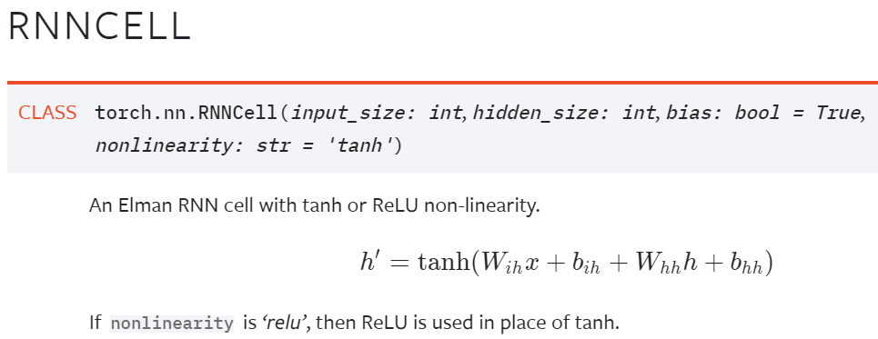
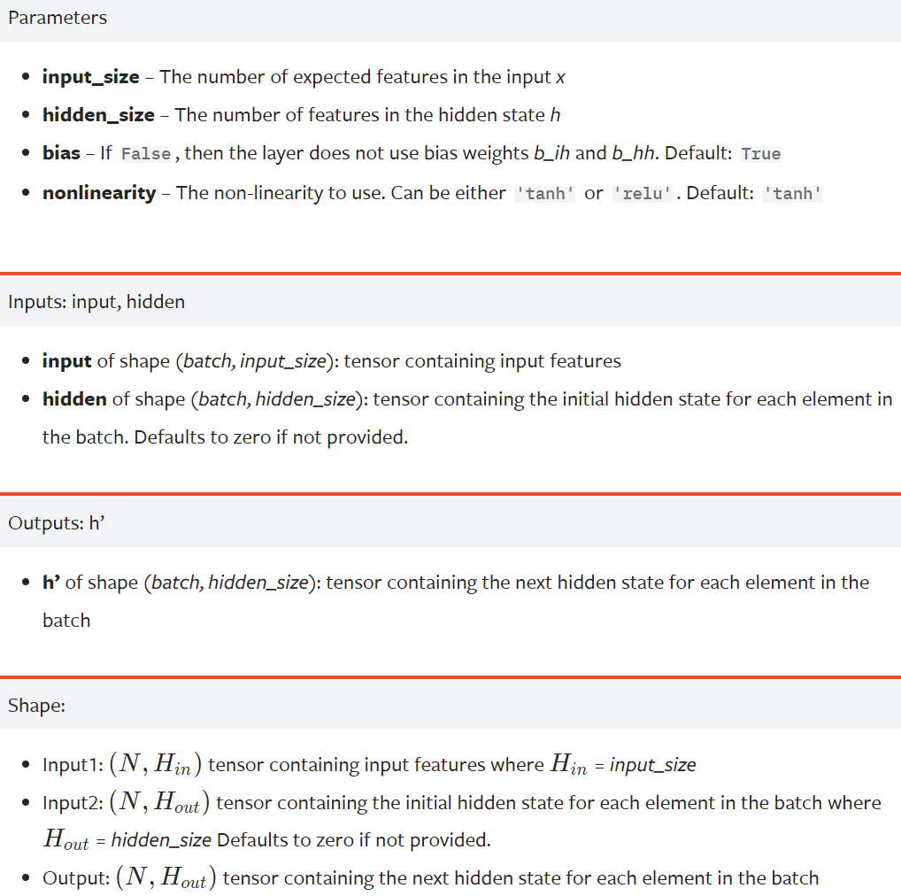
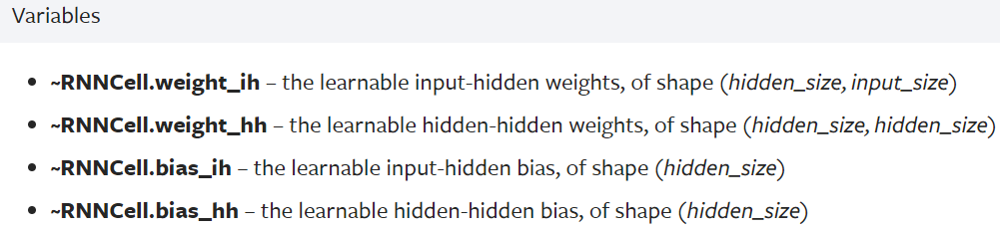
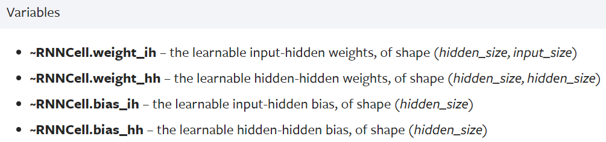

# [广播](https://pytorch.org/docs/stable/notes/broadcasting.html)

Two tensors are “**broadcastable**” if the following rules hold:

- Each tensor has at least one dimension.
- When iterating over the dimension sizes, starting at the trailing dimension, the dimension sizes must either be **equal**, **one of them is 1, or one of them does not exist.**

```python
>>> x=torch.empty(5,3,4,1)
>>> y=torch.empty(  3,1,1)
# x and y are broadcastable.
# 1st trailing dimension: both have size 1
# 2nd trailing dimension: y has size 1
# 3rd trailing dimension: x size == y size
# 4th trailing dimension: y dimension doesn't exist

# but:
>>> x=torch.empty(5,2,4,1)
>>> y=torch.empty(  3,1,1)
# x and y are not broadcastable, because in the 3rd trailing dimension 2 != 3
```

If two tensors `x`, `y` are “broadcastable”, the **resulting tensor size** is calculated as follows:

- If the number of dimensions of `x` and `y` are not equal, prepend 1 to the dimensions of the tensor with fewer dimensions to make them equal length.
- Then, for each dimension size, the resulting dimension size is the **max** of the sizes of `x` and `y` along that dimension.

For Example:

```python
# can line up trailing dimensions to make reading easier
>>> x=torch.empty(5,1,4,1)
>>> y=torch.empty(  3,1,1)
>>> (x+y).size()
torch.Size([5, 3, 4, 1])

# but not necessary:
>>> x=torch.empty(1)
>>> y=torch.empty(3,1,7)
>>> (x+y).size()
torch.Size([3, 1, 7])

>>> x=torch.empty(5,2,4,1)
>>> y=torch.empty(3,1,1)
>>> (x+y).size()
RuntimeError: The size of tensor a (2) must match the size of tensor b (3) at non-singleton dimension 1
```

# 梯度


# DataLoader


# [RNN](https://pytorch.org/docs/stable/_modules/torch/nn/modules/rnn.html#RNNCell)

[理解 LSTM 网络 （Understanding LSTM Networks by colah）](https://blog.csdn.net/Jerr__y/article/details/58598296)

[TensorFlow入门（五）多层 LSTM 通俗易懂版](https://blog.csdn.net/jerr__y/article/details/61195257)

[TensorFlow中RNN实现的正确打开方式](https://zhuanlan.zhihu.com/p/28196873)

[循环神经网络简介](https://fancyerii.github.io/books/rnn-intro/)

[利用TensorFlow构建LSTM模型](https://zhuanlan.zhihu.com/p/27087310)

## 




# LSTM


# GRU

